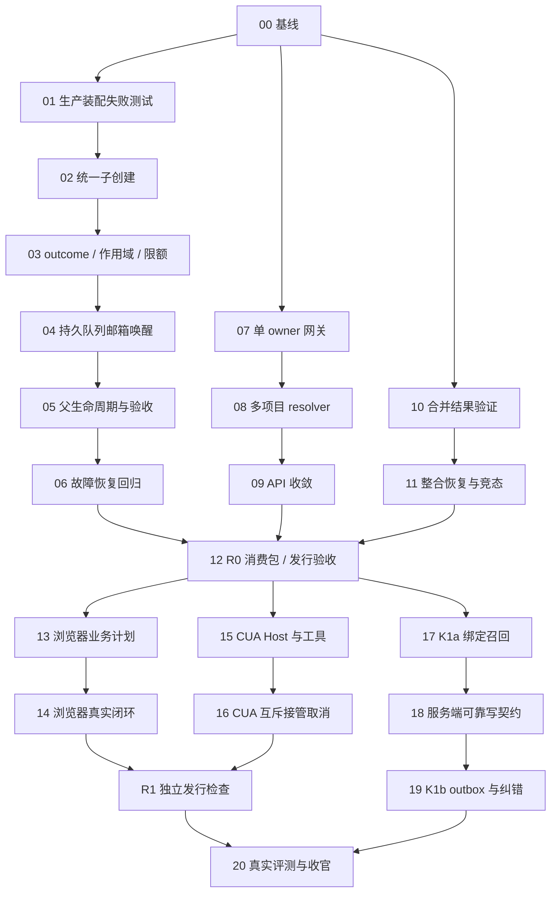

# Lectern 生产链路收口：执行计划与任务清单

- 日期：2026-09-28
- 状态：计划待实施；以下所有任务默认未开始
- 文档审查：独立复审通过（2026-09-28）；仅确认计划完整性与可执行性，不代表实现或验收通过。
- 对应规格：../specs/2026-09-28-production-chain-closure-spec.md
- 规则：按真实代码调整具体文件名，不降低规格验收；每任务交付代码、测试、证据和变更说明
- 计划技能说明：当前环境未发现 writing-plans/SKILL.md，本计划按已有仓库格式与 brainstorming 设计流程编写，不声称调用了不存在的技能。

## 1. 执行方式

先复现和钉住失败，再做最小修复，最后跑真实装配和发行物。失败用例可以作为同一变更的中间状态，不把红测试直接合并到主线。生产装配测试不得把要验证的 registry、Host resolver、Coordinator 或验收门禁替换成全绿 stub；模型可以 scripted，外部副作用可在 fixture 内可计数。

工作流：干净隔离 checkout → 基线核对 → 单任务实现与验证 → 代码审查 → 更新任务证据 → 依赖任务继续。保留用户无关改动。Framework 与 Lectern 不同仓库，先锁定对应 commit/包 hash，再验证消费端，不能靠相邻源码自动生效的假设。

进度记录分为 not_started / implementing / verified / blocked。完成一任务必须填写 commit、实际验证命令、结果文件、局限；实现完成但环境未验证保持 implementing 或 blocked，不用“代码都有了”替代 verified。

## 2. 依赖图与发布切片

可独立推进的工作流：子代理、Host、多项目/路由、Git 整合。共享文件如 lib/runtime.ts、Host server 与 Framework 装配入口必须明确一个修改负责人，其他任务通过稳定接口集成，避免同时改同一装配面。并行工作不是并行写同一业务工作区。

R0 为 T00–T12；R1 为 T13–T16；R2 为 T17–T20。R1 与 K1a 可在 R0 后并行；T20 收齐全部适用证据。真实模型基线的 fixture 与数据收集可从 T00 开始，不等最终一天才设计评测。

## 3. R0 任务

### T00 — 固定基线与验收映射

- [ ] 记录三个仓库 HEAD、工作区状态、Lectern/Framework 版本、vendor hash、安装包导出；检查是否有适用 AGENTS.md。
- [ ] 将规格 PC01–PC23 映射到实际测试文件、层级（模块/生产装配/进程/原生/远端）和所需环境。
- [ ] 复跑本次 84 项基线与现有类型/架构检查，保存机器可读结果；旧测试报告只作参考。
- [ ] 准备两个项目、两个 worktree、scripted provider、计数工具、丢响应代理与可控退出点；准备真实模型 6 类 fixture。
- 文件：evals/、e2e/、scripts/；避免把用户数据放进 fixture。
- 完成：基线报告和映射齐全，失败/不可用明确记录。无依赖。

### T01 — 锁定真实装配缺陷

- [ ] 通过 Lectern 实际 runtime 工厂取得注册工具，触发 agent_spawn，证明 undefined registry 错误；同样覆盖旧 task。
- [ ] 以真实 runAttempt 的 failed/blocked outcome 证明宿主固定 completed 的缺陷。
- [ ] 根 Task 有 pending 子结果时调用真实交付路径，证明未传 subagentPending 的缺口。
- 文件：lib/runtime.ts 对应装配集成测试、Framework server/create-agent-runtime 集成测试。
- 完成：PC01/PC02/PC08 的基线失败可定位、断言与复现说明齐备；本任务不要求修复后绿。回归测试与后续 T02/T03/T05 的修复一并合并，最终生产门禁在 T06/T12；测试不能直接替换被测协调器。
- 依赖：T00。

### T02 — 唯一 ChildSessionFactory

- [ ] 新旧工具共用父身份解析、registry、权限/深度、子上下文与凭据引用；移除占位 registry 和伪 Session。
- [ ] 以工具调用身份稳定生成 spawnRequestId，事务创建 child 与协调记录，校验异 payload 重用。
- [ ] 更新 createAgentRuntime/create-server 公共契约与 Lectern runtime 接线；保持旧 task 返回兼容。
- 文件：Framework core/subagents/{tools,coordinator}.ts、runtime/runner.ts、server/*；Lectern lib/runtime.ts。
- 完成：PC01、PC04，含失败 rollback 和安装包消费路径。依赖：T01。

### T03 — 子 outcome、隔离与 Host 全局限额

- [ ] runChild 传播真实结构化结果；summary、证据、waiting/blocked/unknown 进入协调记录。
- [ ] 校验所有 list/send/wait/cancel 的根树范围，继承父权限上限和附件 scope，禁止模型任意 childId 越权。
- [ ] Host 级 AdmissionController 统一各 Runtime 限额，释放资源按执行状态而非 Promise 返回猜测。
- 完成：PC02、PC03、PC07 的状态单测，两个项目并行时限额正确。依赖：T02。

### T04 — 持久队列、mailbox 与唤醒

- [ ] 将 queued 输入与契约、wake intent 写入 store；定义 schema migration 与唯一键。
- [ ] 子终态、邮箱和唤醒同事务；实现 Scheduler 认领/重试、父 epoch 校验及启动对账。
- [ ] ContextManifest/Attempt 记录与消费水位联动，避免读出即消费后崩溃丢结果。
- [ ] agent_send 纳入 queued、running 安全边界和 waiting_input 恢复路径。
- 文件：Framework session/sqlite-store、subagents/{store 面,parked,coordinator}、runtime/run-scheduler、context-builder。
- 完成：真实 SQLite 的队列、邮箱、唤醒事务及断点恢复测试通过，PC07 的存储与调度接口就绪；PC05–PC07 的生产自动续跑在 T05/T06 整体验收。依赖：T03。

### T05 — 父生命周期与验收服务

- [ ] 在 TaskLifecycle 真正调用 park/drain；建立可访问的结果验收操作，记录版本与证据。
- [ ] CompletionState 查询实际子记录，替换固定 null；测试完成条件可被满足而非只会拒绝。
- [ ] 验收拒绝进入续跑，返工建立替代关系，仍受根预算约束；根取消设置事务性 admission 截止。
- 完成：PC08/PC09，父自动整合并正常交付；子失败不假成功。依赖：T04。

### T06 — 子代理生产链路故障测试

- [ ] 真实 runtime 工具 → 两个 child → parent parked → mailbox → 自动续跑 → 验收 → delivered 全链路。
- [ ] 在登记、子完成、邮箱入库、父上下文持久化、验收前后注入进程退出。
- [ ] 根取消与子派生/完成竞争；无孤儿、无重复用户消息、无重复副作用。
- 完成：PC01–PC09 全绿，结果附数据记录和事件水位。依赖：T05。

### T07 — 禁止动态回退执行

- [ ] 网关仅在未启用 Host 模式或静态非执行路由返回 null；armed 网络错误返回结构化异常。
- [ ] 保留 requestId 与结果未知状态，增加回执查询/同键重试；客户端不生成新键补发。
- [ ] legacy 模式仅在启动时选定，校验 owner/锁/进程退出；恢复不自动切回另一模式。
- 文件：lib/host-gateway.ts、lib/client.ts、electron/main.cjs、host/src/server.ts。
- 完成：PC10/PC11，Host 收到后断连接仍只执行一次。依赖：T00。

### T08 — Host 多项目 OwnerResolver

- [ ] 删除 Host 捕获默认 rt 的通用处理闭包；按 scope/sessionOwner 取 runtime 和 store。
- [ ] 列表显式 projectId；会话身份不依赖当前 active project；worktree 工具与数据库根分别正确解析。
- [ ] 缺失挂载、重复会话、非法跨项目权限请求和子凭据引用按错误处理，不返回空成功。
- 文件：host/src/{index,server,assembly}.ts、lib/{session-owner,runtime,projects}.ts。
- 完成：OwnerResolver 与已接入路径通过 PC12 对应子集，列明未迁移路由；全路径矩阵在 T09/T12 验收，切换项目不串任务。依赖：T07。

### T09 — 全路由业务 owner 收敛

- [ ] 建立 API 路由清单，标记 Host owner/纯 Next/尚未支持；将执行类全部代理到 Host。
- [ ] 事件、附件、MCP、终端、delivery 与工作区动作统一 resolver；浏览器/CUA 完成迁移前保持明确受限状态。
- [ ] 架构检查覆盖直接/动态导入，禁止 Next 构造运行时及相关资源；移除吞错误式回落。
- 完成：PC11/PC12，Next 重启不改变已迁移任务执行权；R0 后续能力未完成明确列出。依赖：T08。

### T10 — 实际合并结果验证

- [ ] integration journal 新增 merged/verifying/ready_to_advance 状态及证据引用。
- [ ] 注入验证执行器，在临时整合 worktree 跑计划并绑定 merge commit/fingerprint。
- [ ] 没有 required 检查则 unverified，普通接受不得放行；显式未验证接受保留既有产品流程。
- 文件：lib/{workspace-service,workspace-actions,delivery,delivery-git}.ts。
- 完成：PC13，组合失败时目标不变；成功路径才进入 advanceTarget。依赖：T00。

### T11 — 整合恢复与竞态

- [ ] 验证期间目标/源码/计划变化使证据失效；中断后恢复要求证据仍有效。
- [ ] 同一 integration 重试不重复合并；已 checkout 目标 ref/index/tree 一致；未知态 blocked。
- 完成：PC14，保留并通过已有 24 项 worktree 测试及新增集成场景。依赖：T10。

### T12 — R0 消费包与发行验收

- [ ] Framework typecheck/test/build，使用新不可变版本 pack；更新 Lectern vendor 与锁文件并重新安装。
- [ ] 对安装后的导出与实际 createAgentRuntime 重跑 PC01–PC14，不只测相邻源码。
- [ ] Lectern typecheck、arch:check、test、test:release、host:build 和 build；修复本轮引入失败，不隐藏历史失败。
- [ ] 打包后运行多项目、子代理、丢响应、Next 重启与 Host 强杀场景；macOS/Windows 分开记录结果与平台缺口。
- 完成：R0 验收报告、版本/hash、迁移/回滚说明和可审查发行产物；不自动上传发布。
- 依赖：T06、T09、T11。

## 4. R1 / R2 任务

### T13 — 浏览器业务验收计划

- [ ] 将默认 goto+body 标为 smoke；映射 Task 验收条件到 acceptance 检查，缺检查不能普通通过。
- [ ] 给 Agent 注册计划/执行/读证据工具，服务端校验 workspace/attempt/required，不允许事后降级。
- 文件：lib/browser-{verification,orchestrator}.ts、delivery、runtime 装配及对应 UI。
- 完成：PC15。依赖：T12。

### T14 — 真实浏览器闭环

- [ ] 固定表单、导航、错误态与多视口 fixture；真实 Chromium 操作、证据、一次修复、版本失效。
- [ ] Next 重启时 Host 继续持有业务状态；owned/borrowed 生命周期正确，外部未知动作不重放。
- 完成：PC16 和现有浏览器回归。依赖：T13。

### T15 — CUA Host 迁移与模型工具

- [ ] 迁移 broker/记录/所有权到 Host；Electron/macOS adapter 只负责平台操作，Next 代理。
- [ ] 注册受控模型工具，校验 task/session/lease/app、权限、预算与 evidence。
- 完成：PC17，真实 runtime 工具可访问原生能力且不能跨任务借 lease。依赖：T12。

### T16 — CUA 动作互斥、接管与停止

- [ ] 独占 lease 下增单动作队列、稳定 actionId、真实 OS 状态复核及 adapter 取消。
- [ ] 原生用户输入接管与紧急停止；确认排队动作取消、当前未知动作不重试。
- [ ] 平台能力如受限，清楚展示并禁止不受支持的无人值守模式。
- 完成：PC18/PC19 原生 macOS 实测，记录应用/权限；不让自动测试操作用户敏感应用。
- 依赖：T15。

### G1 — R1 独立发行检查

- 前置：T14、T16；不依赖 T17–T19 或 Memory 环境。
- [ ] 按 T12 的版本与发行物规则重新 pack/vendor/install/build；Framework 内容变化必须使用新版本，记录源码 commit、包 hash 与安装版本。
- [ ] 在本次发行物上回归 PC01–PC19 与适用 PC23，保留浏览器及原生 macOS 实测证据。
- [ ] 生成 R1 验收报告、迁移/回滚说明和可审查发行产物；未通过不能将 R1 标为可发布，不自动上传发布。
- 此项为发行检查，不增加功能任务；T20 复用既有证据并验证最终 R2 产物，不能用旧产物证据替代当前产物检查。

### T17 — K1a：身份绑定与只读召回

- [ ] 核对 memory.zmzai.cloud 当前 schema/鉴权与 capabilities，复用用户凭据引用，不配置管理 key。
- [ ] binding、scope、预算召回、来源展示、超时降级、退出/撤权/重绑处理。
- [ ] 在授权测试 bank 实际联调；没有环境保持未验证，不阻塞独立 R0/R1。
- 完成：PC20 的只读与权限场景。依赖：T12。

### T18 — Memory 服务端可靠写契约

- [ ] 为 capabilities/retain/operationStatus/revise/invalidate 写版本化 schema、权限与契约测试。
- [ ] 服务端幂等登记与上游状态对账；没有真实上游幂等保障时 unknown，不盲重试。
- [ ] expectedVersion、来源作用域和 tombstone，成员读权限不能自动变写权限。
- 文件：zmzai-memory/app/api、lib、models、tests。
- 完成：PC21 服务端契约；部署前提供 migration/回滚与原始结果，未经授权不部署。
- 依赖：T17 的契约核对；本地服务端实现可与 T17 UI 接线并行。

### T19 — K1b：候选、outbox 与纠错

- [ ] 父验证后产出结构化候选，经用户项目同步策略入队；对子结论去重，未合并结论保持分支 scope。
- [ ] outbox 持久幂等、有限重试、unknown 查询、原账号/bank/version 锁定；纠错冲突重读。
- [ ] 真实授权测试环境写入/回执/纠错/撤权联调，显式清理测试对象，不触碰真实项目 bank。
- 完成：PC20/PC21 全部；只读模式与完整模式状态区分。依赖：T17、T18。

### T20 — 真实评测与全范围收官

- [ ] 6 类 fixture 各至少 3 次；选定模型、配置、预算可复现，记录所有原始结果与失败原因。
- [ ] 对比升级前后；竞品可用则加入对照，否则标未运行。不能拿模块测试通过推断任务成功率。
- [ ] 重跑全部适用 PC01–PC23，更新总规格状态与剩余清单；R0/R1/R2 分别给实际完成范围。
- 完成：PC22/PC23、源码/消费包/发行物一致证据、真实环境局限和下一轮优先级。
- 依赖：G1、T19。

## 5. 验证命令与证据要求

以下为已存在命令，均在对应仓库运行；新增 PC 测试通过各仓库 test 入口执行，实施时把精确路径补进验收映射。

| 仓库 | 命令 |
| --- | --- |
| zmzai-framework | pnpm typecheck；pnpm test；pnpm build |
| zmzai-lectern | pnpm typecheck；pnpm arch:check；pnpm test；pnpm test:release；pnpm host:build；pnpm build |
| zmzai-lectern 发行物 | pnpm test:packaged（先读脚本，确认隔离数据目录和目标包） |
| zmzai-memory | pnpm typecheck；pnpm test；pnpm build（需要合法测试环境配置，不能把缺少配置记成通过） |

测试报告至少包含 caseId、状态 pass/fail/not_run、仓库 commit、framework tarball hash、安装版本、平台、fixture、执行命令、断言结果和证据文件。报告存 evals/results/ 或现有受控验证目录，禁止提交真实 Cookie、API key、用户聊天与敏感截图。

已列 21 个执行任务与 23 组验收场景。任务进度不要一次性批量打勾，必须以对应证据放行。实现期间新发现的同链路必要修复纳入当前任务；新增产品能力另列，不使收口计划无限膨胀。

## 6. 实施启动指令

可将以下内容交给实施者作为首轮任务：

> 从 T00、T01 开始，按本计划推进 R0。先读对应 spec、当前代码与仓库规则；在隔离 fixture 中复现问题，再实现统一子代理创建入口。不得用 mock 协调器替代生产装配来证明修复，不得让 Host 失败回落 Next 执行。每完成一任务记录 commit、实际测试和剩余项；跨 Framework/Lectern 修改必须验证更新后的消费包。不要自动部署、发布或修改用户真实数据。R0 全验收通过后交付报告，再按用户授权继续 R1/R2。
