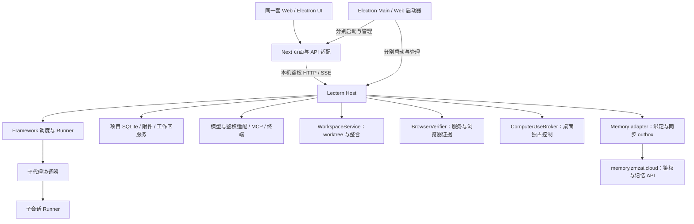

# Lectern Agent 工作台完整升级规格

- 日期：2026-09-21
- 状态：规格草案，供用户审阅；不是已实现能力声明
- 规格审查：Host/Harness 基础版已复审；本次四项扩展待复审。本文为完整目标规格，更新文档不代表开始实施。
- 修订（2026-09-21，评审后）：优化实施节奏——§17 新增执行节奏总则、M2 拆分为 M2a/M2b/M2c、M0 扩充倒排计划与盘点交付物；§8.2 补 waiting_input 出口语义；§16 性能门槛由建议改为硬门禁。
- 范围：`zmzai-lectern`、`zmzai-framework`、`zmzai-memory`；参考复用 `zmzai-agent` 的记忆适配
- 基线：Lectern `a7af143`，Framework `51f061e0`；参考 ZCode `872ad96`
- 已确认产品决策：页面刷新、Next 服务重启不停止任务；退出 Lectern 应用时有序停止。本期不做退出应用后后台驻留。
- 目标：以可测量的可靠性为基础，建立独立 Host、明确命令与状态边界，并交付可并行、可控制、可恢复的子代理能力。

## 1. 任务与范围

本规格涵盖上一轮架构分析中的 P0（对照评测）、P1（独立 Host、协议与归属、Runner 拆分）以及子代理控制。按依赖顺序分阶段实施，每阶段独立验收，但最终必须形成同一套运行链路。

Agent Harness 的补充范围见 §9：上下文与压缩、模型能力与降级、工具执行契约、子代理任务契约与父级验证、恢复/撤销边界、资源回收。这些是基础阶段执行规则。扩展阶段纳入 §10 worktree、§11 浏览器验证、§12 computer use 和 §13 云端项目记忆；仍不建设新的记忆后端或子代理多 worktree 自动整合。

### 1.1 用户可感知的结果

1. 任务执行期间刷新页面、关闭后重开浏览器页面、重启 Next 服务，任务继续执行，重新打开后可恢复完整状态。
2. 重复点击发送或网络重试，不会执行两次；旧页面上的停止和权限回复不能影响新一轮执行。
3. 主代理可同时派出多个只读子代理，继续做自己的工作；可以查看、发消息、等待及取消子代理。
4. 子代理修改工作区时有明确的独占写入规则；主代理不会在同一目录并行修改，也不会在子代理尚未收尾时宣布任务交付。
5. 应用退出、Host 崩溃、子代理失败、模型鉴权失效均有可解释、持久化的状态，不伪装成任务完成。
6. 每次升级都能通过相同场景评测，区分任务能力进步与运行可靠性回归。

### 1.2 完整范围与分期边界

基础阶段 B0 沿用 M0–M4；扩展阶段 W1（任务 worktree）、V1（浏览器验证）、C1（macOS computer use）、K1（项目记忆）见 §17。旧文中的“本期/首期”默认指 B0；§10–§13 中指对应扩展阶段。完整目标完成需 B0 与四项扩展都验收，不能把其中一阶段通过称为全部完成。

完整目标仍不做：

- SSH / WSL / 云端执行、手机远控、多人协作、常驻后台服务。
- 替换 Next.js、PI、SQLite、HTTP/SSE，或移植 ZCode 的完整目录结构。
- 一子代理一系统进程、同一工作区多写者并行、自动合并多个子代理 worktree。
- 插件市场、完整 TUI、大规模聊天视觉重做；Windows computer use 留待后续平台阶段。
- 承诺对任意 shell / MCP 外部副作用实现 exactly-once 或崩溃后的无条件自动重放。

## 2. 基线事实与必须保留的行为

源码已具备：SQLite 会话与事件、requestId 幂等、持久化排队、租约恢复、SSE since 重放、持续任务 TaskRecord、交付声明、附件解析、项目/worktree 归属校验和发版验证。

相关入口：

| 现有位置 | 当前职责 / 本期处理 |
| --- | --- |
| Lectern `lib/runtime.ts` | Runtime/MCP/终端/模型/租约装配；迁入 Host |
| Lectern `lib/session-owner.ts`、`lib/projects.ts` | 归属和项目数据；迁入 Host，建立可重建索引 |
| Lectern `lib/request-cookie.ts` | 请求级 ALS 鉴权；跨进程后改成显式执行上下文 |
| Lectern `lib/client.ts`、`app/api/**` | 保留浏览器接口，API 变成 Host 适配层 |
| Lectern `lib/attachments/**`、交付与 worktree 模块 | 有状态读写与执行进入 Host；UI 纯函数保持原位 |
| Framework `src/core/runtime/runner.ts` | 已超过 2,000 行；按职责渐进拆分 |
| Framework `src/core/tools/task.ts` | 当前 sequential 且等待子任务完成；保留兼容入口 |
| Framework `src/core/runtime/runner.ts::spawnSubagent` | 创建新 Runner，但其句柄局限于调用内部；升级成持久协调关系 |
| Framework `src/core/task/types.ts` | 沿用 Task 状态，不能重新把单轮 completed 当成交付 |

`capabilities.subagents: 1` 表示嵌套深度，不是并发数量。新增并发参数不得复用该字段。

本规格定义新增行为。已有规格中与实际实现不一致的历史背景不作为回退依据；实施时同时核对当前代码、测试和既有验收报告。

## 3. 方案选择与总体架构

选择：**单一 Host 渐进抽离**。

- 仅拆目录：改动小，但 Next 与运行时故障域不变，不能满足目标。
- 单一独立 Host：保留现有框架和传输，足以完成本期进程、状态和子代理控制。
- 多级 Host + 每 Agent 独立进程：隔离更细，但协议和资源调度开销更高，留待证据证明需要时再做。

### 3.1 状态所有者

| 状态 / 资源 | 唯一业务所有者 |
| --- | --- |
| 原生窗口、原生文件选择、启动/停止 Next 与 Host | Electron Main |
| Web 模式进程生命周期 | Web 启动器 |
| 命令登记、任务/会话/子代理/权限、持久事件 | Host 内的 Framework 服务 |
| 项目注册、会话归属索引、worktree、附件、交付资源 | Host 业务服务 |
| 终端、MCP、文件操作、模型连接 | Host 管理的适配器 |
| 页面选中项目、面板、输入草稿、临时 optimistic 状态 | UI |
| HTTP 入参解析、登录入口、Host 代理 | Next；不能持有运行中任务事实 |
| worktree 创建/准备/整合 journal | Host WorkspaceService；Git 为仓库事实来源 |
| 浏览器验证服务与 context、证据归属 | Host BrowserVerifier；复用 DeliveryAttempt |
| 桌面观察与输入控制权 | Host ComputerUseBroker + 平台 adapter |
| 项目记忆绑定、待同步候选、凭据引用 | Host Memory adapter |
| 记忆事实、云端访问权限、写入操作回执 | zmzai-memory 服务；Host 不能自行授予 bank 权限 |

Framework 不依赖 Next、Electron 或 Lectern 的文件路径。Host 是组装入口，不把所有业务重新塞进一个大文件。

## 4. P0：对照评测与基线冻结

### 4.1 两类评测分开

A. **确定性可靠性套件**：注入 scripted provider 和可计数工具，验证状态与副作用，不依赖真实模型回答。

B. **真实模型任务集**：固定模型标识、端点、参数、任务仓库 commit、允许工具和预算，对比升级前 Lectern、升级后 Lectern与 ZCode。不同产品系统提示和工具协议保留原状并记录差异，不声称完全控制所有变量。

任务集至少包含 12 个版本化案例：项目理解、跨文件修改、修复失败测试、附件约束、长上下文压缩、执行中追加约束、权限拒绝、工具错误纠正、模型重试、并行探索、受控写入委派、子代理结果整合。每例至少 3 次独立运行，使用隔离 fixture，禁止对用户实际项目做基准写入。

记录：提交版本、配置摘要、输入与 fixture、结果证据、成功/失败类别、人工介入次数、时间、token、可得时的费用。token/费用缺失记录 null，不能视为 0；价格不硬编码成长期事实。

### 4.2 判定

- 任务完成由预先定义的测试、文件断言或人工评审 rubric 判定，不使用模型自称完成作为唯一依据。
- 当前里程碑适用的可靠性用例及全部既有回归通过，是该里程碑的硬门禁；尚未实现的后续用例标记未实施，不能伪报通过。M4 覆盖 B0 的 A01–A40；W/V/C/K 用例分别由对应扩展阶段验收，完整目标才要求全部通过。
- 真实模型固定预算下，升级后总通过数不得低于升级前；任何案例从 3/3 降为 0/3 必须调查后才能发布。结论同时给出原始计数，避免小样本百分比误导。
- 与 ZCode 的比较是追赶报告，不作为未定义的“体验差不多”验收。首次目标是相同任务预算下整体通过数不低于 ZCode；未达到时明确剩余案例，不阻止单独交付已经通过的基础设施里程碑。
- 无可用真实模型凭据或 ZCode 无法运行时，报告为未验证；不能用 mock 结果替代真实模型对比完成声明。
- 产出版本化案例、执行说明、机器可读结果及 Markdown 基线报告。真实模型结果只在相关运行时/工具改动与发版时重跑，不要求每次普通 UI 提交消耗模型预算。

## 5. P1-A：Host 生命周期与本机通信

### 5.1 启动与版本

- 每个 Lectern 数据目录只允许一个 Host。互斥锁须结合活体握手，不能仅凭 PID 文件或删除锁文件接管活进程。
- Desktop 由 Main 分别启动 Host 与 Next；Web 由统一启动器分别启动二者。Next 不是 Host 的父生命周期所有者。
- Host 监听随机 loopback 端口；由启动器生成随机高熵 token，通过受控进程通道/环境交给 Next。token 不发送到 renderer、不放 URL、不落日志。
- Host 拒绝缺少 token、非法 Origin 和不支持的协议版本；loopback 不是鉴权替代品。Next 的变更接口保留并测试现有认证与同源防护，不因转发而开放本机能力。
- 启动握手返回 `protocolVersion`、`hostInstanceId`、`capabilities`、`schemaVersion`、健康状态。协议主版本不兼容时拒绝接入并显示升级/重启说明，不静默回退到进程内 Runtime。
- 持久安装身份 `hostId` 与每次启动随机 `hostInstanceId` 分开；重启不能复用旧执行权。

### 5.2 重启、退出与失联

- 页面和 SSE 断开只结束订阅，不能取消模型运行或工具执行。
- Next 重启后重新握手，通过持久命令回执、快照和事件恢复；不得重新创建相同任务。
- 正常退出：停止接收新命令 → 取消全部任务树 → 终止 Host 管理的进程树/终端/MCP → 持久化结算 → 关闭数据库 → 退出 Host → 退出 Next/Main。
- 退出最多等待 10 秒；超时后终止仍存活的受管进程树，遗留记录下次进入恢复流程，不写“已完成”。
- 启动器与 Host 使用 IPC 生命周期连接。启动器意外死亡时 Host 按同样的有序停止流程收尾；本期不产生脱离应用的后台服务。集成测试覆盖操作系统不能正常发送退出信号的情况。
- Host 异常退出后启动器最多自动重启 3 次/60 秒；超限展示故障，避免崩溃循环。重启后持久命令可查询，运行中的未知副作用必须进入恢复审查。
- Web 关闭浏览器标签页不等于退出启动器；只有终止 Web 启动器才有序停止服务。

### 5.3 鉴权与附件不可遗漏

原来的 AsyncLocalStorage cookie 不能穿过进程边界。Next 在接收命令时提取必要的用户鉴权，使用受保护的内部请求建立 Host 内存中的 `credentialRef`；执行上下文只引用它。不要转发全部浏览器 Cookie。

- 排队命令、内部续跑、子代理继承同一用户的 credentialRef，不能依赖原 HTTP 请求仍然存活。
- 用户退出登录时撤销该身份引用，阻止后续模型请求；持久化登录等待状态。凭据过期后进入现有 `waiting_external`，重新登录显式刷新引用后恢复原任务。
- Host 重启丢失内存 cookie 时，使用已有合法持久凭据或等待重新绑定；不得把 cookie 写进命令日志、事件、评测轨迹和子代理提示。
- 附件存储、提取队列、绑定和清理进入 Host。Next 只流式转发上传/下载，保留大小限制、会话归属和幂等边界。
- 子代理仅获得显式授权的父任务附件引用；Host 校验 parent-child 关系及附件 scope，不能绕过现有 `getScoped` 直接读任意附件。

### 5.4 路由迁移清单

以下路由族的业务实现均转入 Host：`sessions`（含消息、任务、权限、附件、搜索、读状态、worktree）、`projects`、`fs`、`git`、`terminal`、`mcp`、`skills`、`plugins`、`repomap`、`deliveries`、`preview`、运行时相关 `settings`、`models` 与 `agents`。

`auth` 保留 Next 的登录交互/代理，但鉴权更新必须同步 Host；`shutdown/graceful` 调用 Host 控制面。迁移表逐路由记录 owner、请求/响应 schema、流式行为和测试位置，所有既有路由均需有去向。

验收后 Next 禁止导入 Runtime、SQLite store、终端/MCP 管理器及有状态 Host 服务。纯类型、schema 和纯投影函数允许共享。不能一半路由直写数据库、另一半通过 Host 写。

## 6. P1-B：身份、命令与事件协议

### 6.1 身份模型

沿用 `projectId`、`sessionId`、`taskId`，新增明确的工作区身份和执行代际：

- `workspaceId`：持久不透明 ID；主工作区和每个 worktree 分开标识。
- `workspacePath`：当前真实执行路径，由 Host 解析；项目路径变化不能悄悄创建新身份或改绑会话。
- `runId`：现有 workflow run 的统一关联标识，不另造第二套同义执行记录。
- `attemptId`：一次内部模型尝试，区别于持续任务和 workflow run。
- `executionEpoch`：运行执行权代际；旧回调、工具结果和权限回复必须被拒绝。
- `traceId`：一次根 Task 及全部子任务的关联标识；子 span 保留父关系。

会话归属用 Host 索引查询，不能每个请求扫描所有项目数据库。项目数据库仍是会话事实来源，索引是可重建投影。

索引写入失败时从项目事务内的变更记录补齐；新建会话必须在索引可查询后才返回成功。启动重建/增量对账完成前不提供未经核对的归属。重复 sessionId、缺失挂载、错误 worktree 关联继续明确报错，不回落到当前选中项目。路径和 symlink 校验仍在实际执行前进行，索引命中不能替代验证。

Host 控制数据库成为项目注册、workspace 身份与 control 命令的权威存储，首次导入现有 projects.json 并保留其 projectId；迁移后旧 JSON 只作备份，不能继续双写。control 操作涉及项目数据库初始化时使用持久 initializing/ready/failed 进度和可重入初始化步骤，只有 ready 项目接受执行命令；不要求跨数据库单事务，也不能将 initializing 回执解释为项目已可执行。

### 6.2 执行租约与进程隔离的边界

- admission 在事务中取得 run 的唯一执行权，并持久化 owner hostInstanceId 与 executionEpoch；续租、结算、取消和回收均带比较条件，不能由旧 owner 清除新租约。
- 本期默认租约 30 秒、每 10 秒续租、每 5 秒检查失效；时间读取可注入测试时钟。失去续租能力时停止接收新工具调用并取消当前执行，不继续盲写。
- 同一 Host 内的恢复扫描不能回收仍持有有效租约的任务。Host 重启确认旧 owner 已死亡后可立即结算旧代际，无需等待完整租期；同时确认遗留受管进程已退出，才可再次授予 workspace 写权。
- 数据库 fencing 能拒绝旧事件/结算，但无法撤回已发出的 shell 或远端请求。进程树清理或副作用核对未完成时维持 blocked；不可仅因为租约过期就启动第二个写者。
- 单 Host 仍是共享故障域；本期获得的是页面服务与运行时隔离，不承诺一个子代理导致的进程崩溃不会影响其他子代理。

### 6.3 命令契约

所有变更命令经过运行时校验，至少包含：`protocolVersion`、`requestId`、操作名、目标身份与 payload；执行期控制命令额外带目标 run/epoch 或对应权限请求身份。`traceId` 由 Host 创建或从合法任务继承，不信任客户端任意指定的归属。

命令：发送/追加、取消、恢复、权限回应、压缩、回退、会话创建/删除，以及子代理派生、消息、取消。提供按 requestId 查询回执；等待和查询属于只读操作。

- 幂等键按数据目录、用户身份、稳定 commandScope 与 requestId 定义。项目业务 commandScope 为 projectId，项目注册等全局管理命令使用 control；同键同规范化 payload 返回原回执，不重复登记，同键异 payload 返回 409。
- 项目命令回执存项目数据库，control 命令回执存 Host 控制数据库。查询回执必须携带原 commandScope；客户端发送前固定 scope，超时或切换项目后也不改 scope。同 requestId 用于两个项目是两个独立命令；跨 scope 重发不属于重试，UI 不得自动这样做。
- 新协议 command 登记与业务变更使用同一事务；已有 prompt workflow 适配为该命令的一部分，不能产生两套独立队列。跨库索引变化通过事务内 outbox 异步补齐。
- durable receipt 返回 accepted/queued/rejected、commandScope 及稳定 command/task/run 身份；accepted 不表示任务完成。项目内命令提交后即使全局索引尚未同步，仍能按显式 scope 查询原回执，不依赖全局索引判断是否执行过。
- 超时/断网表示结果未知。客户端查询回执或原 requestId 重试，不生成新 requestId“补发”。
- 请求取消目标若已结束，返回已结束；旧 epoch 返回 `STALE_EXECUTION`，不能转而停止最新任务。
- 发送/追加仍沿用现有持续 Task 的语义。新独立目标不得误并入旧 Task，控制面迁移不能改变现有判定。
- 归属、权限、取消及审批必须在 Host 再检查，不能只靠前端按钮隐藏。

错误使用 `{code,message,retryable,requestId,details}`，至少区分：无效输入、冲突、未知归属、资源不可用、执行过期、恢复必需、Host 不可用、鉴权失效、版本不兼容。details 不包含凭据或用户原始秘密。

### 6.4 快照与事件

- 继续使用 SSE，新增版本化 envelope；历史事件通过适配读取，不原地破坏。
- 每个 session 的事件带 `seq`、`streamEpoch`、类型、任务/执行身份、时间与 payload。
- 快照返回同一一致性读中的业务投影和水位 `{streamEpoch,lastSeq,revision}`；订阅从水位之后 replay，再无缺口切换 live。
- 客户端按 epoch+seq 去重。发现序号缺口、回退导致流版本变化或水位失效，重新取快照；不能把缺口后的事件当作已完整应用。
- 事务性业务变更与对应 durable 事件同事务提交，或同事务写 outbox，由可重试发布器投递；先广播后落库不允许。
- 传输为至少一次，投影要幂等；不声称网络 exactly-once。
- rewind 使旧流游标失效时显式递增 streamEpoch，不能仅以事件总条数作为安全水位。已删除会话返回终止语义，不无限重连。
- 慢订阅者使用有界缓冲，超限通知重新同步并断开，不能使 Host 因页面不消费而无限占用内存。

## 7. P1-C：Runner 拆分与依赖约束

按职责划分，命名可在实施时微调，但所有权不能重叠：

| 单元 | 负责 | 不负责 |
| --- | --- | --- |
| CommandService / Store | 命令校验、幂等登记、回执 | 模型调用 |
| RunScheduler | FIFO admission、运行租约、恢复调度 | 聊天组件状态 |
| TaskLifecycle | 沿用 TaskRecord、续跑、阻塞、交付条件 | HTTP / Electron |
| AttemptExecutor | PI 适配、上下文、工具执行钩子 | 项目路径全局变量 |
| ContextBuilder / CompactionStore | 按任务事实组装上下文、预算、摘要投影与失效 | 修改真实对话、授予权限 |
| ToolExecutor | 工具契约、执行记录、权限/写权检查、超时与输出限制 | 猜测任务已交付 |
| SubagentCoordinator | 子任务记录、消息、并发、取消树、结果消费 | Next 请求上下文 |
| EventProjector / Publisher | 持久事件、快照与 outbox | 反向调用 UI |
| Host adapters | 模型、文件、MCP、终端、配置和日志 | 再定义一套任务状态机 |

先通过现有测试建立行为基线，再搬移职责，最后增量加入协议与协调能力；不能把大规模拆分和状态机语义重写一次合并。

CI 架构检查禁止：UI/Next 导入 Host 有状态实现、Framework 导入 Lectern、领域层导入 Next/Electron、跨域直接实例化 Repo、循环依赖。对本期新增模块实施边界约束，历史豁免逐条列出，不使用全目录忽略。

文件超过 400 行触发职责审查，不以机械拆文件或压缩行数作为验收。ChatView/Composer 只抽出本期涉及的会话同步、命令状态与子代理呈现，不重构无关编辑功能。

## 8. 子代理：持久协调与执行规则

### 8.1 工具接口

新增模型可用接口，均通过 Framework 服务调用，不在工具实现里另建调度器：

| 接口 | 行为 |
| --- | --- |
| `agent_spawn` | 指定有界子目标、agent 类型、read_only / workspace_write 模式、必要上下文/附件；返回持久 childId 和排队状态，不等待执行结束 |
| `agent_list` | 查询当前 Task 所属子代理及状态、最近进度 |
| `agent_send` | 幂等发送约束/补充信息，在安全边界交付，不中断正在进行的文件写入 |
| `agent_wait` | 按 childId 等待首个终态或需要处理的状态；最多 30 秒，无变化返回仍在运行；不改变执行状态 |
| `agent_cancel` | 幂等取消目标及其后代，返回取消已登记；完成停止通过状态确认 |

旧 `task` 工具成为 spawn + wait 的兼容封装，保留原返回形态。其串行调用行为保持兼容，但底层不再私建不可寻址 Runner。工具 schema、能力发现和系统提示同时更新。

首期默认最大嵌套深度 1；每个根 Task 最多 3 个运行中子代理，Host 全局最多 6 个运行中子代理。二者独立于深度配置，均可配置，并将实际值写进评测配置。队列按根 Task 轮转、根内 FIFO，避免某一任务占满所有额度。

### 8.2 持久模型与状态

新增 SubagentRecord：`childId`、`childSessionId`、`parentSessionId`、`rootTaskId`、`parentTaskId`、`spawnRequestId`、`agentType`、`goal`、`mode`、`workspaceId`、`status`、`revision`、执行 run/epoch、traceId、时间、结果引用和消费状态。

生命周期：`queued → running ↔ waiting_permission / waiting_input / waiting_external → completed | failed | cancelled`；取消中使用 `cancelling`，崩溃先进入 `recovering`。副作用不确定时进入 `blocked` 并保留恢复原因，不能直接完成。等待状态的出口互不替代：`waiting_input` 由父代理经 agent_send 交付的补充输入或用户在根会话的回复解除；`waiting_permission` 只能由对应权限审批解除；`blocked` 只能由恢复流程解除。鉴权失效映射 waiting_external；同身份重新登录绑定凭据后，仍需核对取消状态、权限与执行代际，才可重新排队。

- SubagentRecord 是协调状态；childSession 保留 transcript；子会话原有 TaskRecord 如存在仍负责其任务语义。协调器从实际执行/Task 终态生成结果，不能建立相互矛盾的两套完成判断。
- spawn 登记、childSession 关联、初始排队和父事件在同一项目数据库事务完成。
- 不以 `runLoop` Promise 正常返回推断成功，必须读取明确 outcome；工具失败、取消和阻塞分别映射。
- 结果包含状态、summary、evidenceRefs、产物/改动引用、错误或阻塞说明、usage；大结果落资源存储，仅传有界摘要及引用。
- 父结果投递使用持久邮箱，messageId 去重。记录已投递与已由父执行器纳入上下文；父崩溃后可重放，不能重复增加用户消息。
- 子代理发送消息只允许当前任务树内可见目标，本期不跨根 Task 通信。
- 对 completed / failed / cancelled 子代理调用 agent_send 返回 `CHILD_TERMINAL`，不复活旧子代理；要重新执行必须显式 spawn。对 blocked 或等待权限的子代理可以登记消息，但消息本身不能解除安全阻塞或替代审批。

父执行器的自动续跑规则：

- 父模型轮次结束但必要子代理尚未终态时，根 Task 保持 running，调度器持久化 `parkedReason=children`，UI 显示“等待子代理”；释放父模型并发槽，不靠空转模型轮次轮询，也不要求用户发送“继续”。这属于调度状态，不新增第二套 Task 生命周期。
- 子结果入邮箱与父唤醒意图在同一项目事务落库。根已 parked 时，RunScheduler 为同一 Task 调度内部续跑；根仍在执行时，在下一个安全边界纳入消息，不并行启动第二个父执行者。
- 唤醒使用持久 mailbox 水位与 Task/epoch 做幂等合并。多个子代理同时完成最多产生一个待执行父唤醒；在已经开始的父续跑之后到达的新结果可安排下一次续跑，不得丢失。
- 父接收结果、准备进入 parked、子完成与取消之间均使用事务/CAS 防止丢失唤醒。崩溃后调度器对账未消费邮箱和唤醒记录；模型请求可以重试，但消费水位、消息投影和可见结果不得重复追加。
- cancelling、cancelled、failed、delivered 的父任务拒绝自动唤醒。已发出但迟到的子结果可以记录诊断，不能把终态根任务恢复为 running；重新执行必须走用户显式恢复或新任务规则。

### 8.3 并发与工作区写入

首期支持并行只读探索和共享工作区单写者，不用 prompt 约定冒充隔离。

- read_only 子代理允许审计过的读取工具；不提供任意 bash、交互终端、写 Git 或未知副作用 MCP。需要测试/构建等可能写文件的命令时必须改用 workspace_write。
- workspace_write 子代理可以排队，但同一 workspace 同时只允许一个执行树内写者；取得写权时父代理暂停工作区写入，仍可推理、通信与只读查询。
- 写权由 Host WorkspaceAccessCoordinator 发放，包含 executionEpoch。所有 Host 管理的变更入口必须检查写权，包括编辑器保存、delivery/git、terminal、MCP 与工具。另一个根 Task 的冲突写入进入明确队列/忙状态，不能绕过控制器。
- 写权移交之前，已有写操作和受管终端进程必须收尾；无法判断为只读的存活终端阻止移交。不能把 terminal_start 返回等同于进程副作用结束。
- 自由 shell/MCP 无法证明路径范围时只允许 workspace 级独占，不宣传 writePaths 是操作系统沙箱；声明路径白名单不能约束任意外部程序。
- 有路径限制的子代理，本期仅开放可强制校验的文件写工具；禁止其通过任意 shell、终端、MCP 绕过路径限制。路径需规范化并校验 symlink；父权限是上限，子代理配置不能提升权限。
- 外部编辑器不受 Host 写权控制。读写证据记录版本/hash；编辑和整合前校验预期版本，冲突返回重读/重新验证，不静默覆盖。
- 只读子代理可能看到写入前后的不同版本，其引用包含文件 hash/版本；父代理整合时对已变化文件重新读取验证，不承诺快照隔离。
- 不在这一期做多 worktree 自动合并；现有用户级 worktree 隔离继续保留。

### 8.4 权限、取消、预算与失败

- 子代理权限取父权限上限与自身能力约束的交集。父配置为 deny 的操作不能被子配置 allow 覆盖。
- 权限请求持久化，并在根会话显示子代理来源；回复定位到具体 request、child、run/epoch。恢复后的旧审批不能批准新的工具调用。
- 父取消 → 持久标记 cancelling → 停止派生和新工具 admission → 取消全部后代与受管进程 → 收尾后标记 cancelled。单独取消一个子代理不取消兄弟；父收到结构化结果自行决定补救。
- 写权只有在受管写操作停止后才能释放。超时无法确认停止时保持 workspace blocked，要求恢复处理，不能放行下一写者。
- 子代理等待用户不占模型并发槽，但不释放仍有活跃写操作的写权。确认全部工具静止后可释放；恢复时重新排队并重新校验环境。
- 子代理使用量计入根 Task 总预算，不能通过派生绕过父预算。根预算、子预算、最大活跃时长在执行上下文中统一管理；对并发请求先预留配额、结算后回收，供应商未返回实际用量时标记估算，不承诺零超额。
- 父 Task 只有在所有必要子代理已终态且结果已纳入、无未处理审批/未知副作用时才可 delivered。已明确放弃的子代理也必须取消收尾。现有 task_deliver 与证据规则继续生效。
- 首期不允许跨 Host 重启自动重放已开始的子代理。确认从未开始的 queued 可重新调度；其余持久化为恢复/阻塞状态，安全性核对后以新的执行 epoch 继续，不重复创建 childId。

### 8.5 UI 最小闭环

根会话提供子代理列表：目标、类型、状态、最近工具、耗时、是否需用户处理；可展开只读子会话记录、发送补充、取消。权限请求显示来源。用户看不到的后台失败不能只留在日志。

刷新后从 Host 快照恢复，不靠组件内临时数组重建。主 Task 与子代理分别显示状态；子代理完成不弹根任务“已交付”。排队、写权等待和等待用户用不同文案。

## 9. Agent Harness 执行规则补充

### 9.1 上下文组装与压缩

现有 `src/core/runtime/compaction.ts` 已有增量摘要投影，但摘要 anchor 主要保留在单次运行闭包中；本期复用该能力并补齐跨 Attempt 的恢复与明确预算，不另写一套 Agent loop。

**上下文来源与边界：**

- Framework ContextBuilder 是唯一组装入口，使用持久 Task 的目标、验收条件、最新约束、有效指令与 Skill、工作区身份、最近对话、未消费子结果和证据引用；Host 通过 adapter 提供文件和配置，不让 ContextBuilder 依赖 Next。
- 指令顺序固定为产品系统规则 → 适用的项目/目录指令 → 当前用户目标与后续修订 → 显式选择的 Skill 执行材料。用户显式修订优先于项目惯例和 Skill 建议；所有材料都不能扩大执行器已授予的权限。
- 项目/目录指令记录来源路径、适用范围和 digest；更深目录规则仅对相应路径生效。任务中途变化在下个安全边界重新加载并记录版本。显式选定 Skill 的 digest 变化沿用现有要求重新选择的行为，不静默替换用户选定内容。
- 搜索结果、文件正文、附件和子代理输出是带来源的数据，不能升格成系统指令；子代理不能通过返回文本覆盖父任务目标或授权。
- 当前目标、有效约束、未完成验收条件、未处理审批与未知副作用、必要子代理及未消费结果必须从持久状态重建；不能只存在于模型生成的摘要里。过时约束保留历史，但不作为当前要求继续注入。
- 建立 ContextManifest，记录 task revision、消息水位、指令/Skill digest、摘要版本、模型能力版本、各块估算 token 和裁剪原因。常规诊断仅记录元数据，不复制完整敏感内容。

**预算与压缩：**

- 对最终发送的 system、messages、工具 schema、附件/图片表示统一计费估算，同一内容不重复计数。预算同时满足模型的 maxInputTokens，以及已知 totalContextTokens 减去输出预留后的限制；两者不能混为同一字段。
- 先保证必需任务状态，再压缩旧历史、用引用替换大工具结果/附件正文，最后保留可容纳的相关近期记录。裁剪必须有清单；不可静默删掉用户约束、待审批操作或尚未消费的子结果。
- 已发出的 tool call 与其 tool result 保持合法配对，压缩边界不能切开一个未结束调用；必要状态无法装入时明确 `CONTEXT_BUDGET_EXCEEDED`，不得循环提交必然超窗的请求。
- CompactionRecord 持久化 summary、源消息 ID/水位、streamEpoch、任务/指令版本、摘要模型与估算。原始历史保持不变，摘要是可丢弃重建的投影，不是会话事实来源。
- 同一有效投影可跨 Attempt/正常恢复复用；rewind、源历史改变或指令版本失效时重新构建。变更只影响最新任务状态时重新注入状态块，不无条件重摘全部历史。
- 摘要调用有取消和根预算约束；空摘要、膨胀、调用失败后保留原可用投影。同一上下文版本最多一次自动摘要重试；仍超预算则阻塞并说明原因，不丢弃必要状态换取继续运行。

### 9.2 模型能力与降级

沿用 `lib/model-caps.ts` 与 provider adapter，迁至 Host 管理。修正当前能力缓存与 Runtime 压缩窗口分开求值的边界。

- 能力索引键包含 provider/endpoint 配置 ID 和 modelId，不能仅按 modelId 缓存。ModelCapabilities 至少表达 maxInputTokens、可选 totalContextTokens、maxOutputTokens、工具调用、图片输入、结构化输出和可用 reasoning 档位；每项保留来源和版本，未知不能当作支持。
- 优先使用显式用户配置与可信 provider 元数据；配置只能收紧已知服务端硬限制，不能扩大硬限制。已知 adapter 默认值可作带来源的 fallback；仍未知的关键能力需先解析或要求配置，不统一假设所有模型都有 128k 窗口。
- 每次模型调用生成不可变能力快照，ContextBuilder、输出预算与实际 provider 使用同一份。上下文压缩所用摘要模型也须满足其自身输入/输出能力，不能把主模型的超长历史直接发给较小摘要模型。
- 网络暂态、429、可重试 5xx 进入有限重试；鉴权、参数/schema 不兼容及预算错误返回对应原因，不对所有错误盲目换模型。初始请求加最多 2 次自动重试/切换，共 3 次实际请求，provider 与 runner 共用该计数，避免层层重试相乘；退避与 Retry-After 受取消和剩余预算约束。
- 只在用户已配置/允许的备用端点中降级。降级前重新检查必需工具、图片、上下文与输出能力；不兼容时保留任务并报告 `MODEL_CAPABILITY_MISMATCH`，不偷偷删图、去掉工具或降低任务要求。
- 部分流式输出按 modelRequestId 标记为中断，不与新请求文字直接拼接。失败请求已经触发工具时，从持久执行记录重建后续上下文，不重放已完成工具。模型请求失败不等于工具副作用失败。
- 降级事件记录原/新模型、原因和受影响能力，UI 可见；已发生请求的用量仍计入根预算。需要新鉴权时走 waiting_external，不能把凭据失败当作任务成功。

### 9.3 工具执行契约

扩展现有 ToolDef / ExternalToolDef，保留 PI 适配。executionMode 仅表达调度偏好，不足以证明无副作用或可安全重试。

| 契约字段 | 强制语义 |
| --- | --- |
| inputSchema / outputSchema | 输入在执行前校验；输出按统一结果 envelope 校验 |
| effect | none / workspace / git / network / system，可多选；另声明是否会变更外部状态 |
| concurrency | parallel_read / workspace_exclusive / serialized，以及 workspace/resource key |
| retrySafety | read_only / idempotent_with_key / never；明确适配器是否真正支持幂等键 |
| timeout / cancellation | 超时值、取消传播和进程句柄；超时不等于已停止 |
| outputLimit | 模型可见字节/token 上限、存储上限、截断提示与资源引用 |
| permission / capabilities | 审批领域、可强制执行的路径边界与子代理可用模式 |

- 执行顺序统一为：参数校验 → 权限判定 → 写权/资源 admission → 再检查取消与 epoch → 持久登记调用 → 执行 → 持久结果与事件 → 释放资源。任何入口不能绕过该流程。
- 同一 toolCallId 重复派发返回原执行记录；非只读调用重试只有在 adapter 支持同一幂等键且状态可判定时才允许。不能声称本地调用 ID 能约束任意远端系统。
- 超时、断连、进程被杀后结果未知，记录 outcome_unknown 并触发现有 unsafe_replay 阻塞；确认尚未启动才可安全重新执行。取消与迟到结果按 epoch 合并，不复活任务。
- 输出超限返回明确截断标记、摘要及分页/文件引用；记录退出码和 stderr 是否截断。完整输出存储也有硬上限，不能用无限日志转储替代无限上下文；达到上限保留诊断标记。
- 外部工具缺少可信副作用声明时按 serialized、可能变更外部状态、never retry 处理，并禁止进入 read_only 子代理。MCP 自报只读只能作为提示，不能替代 Host 的审计/允许列表。
- 不支持的外部 JSON Schema 特性必须明确拒绝或通过受支持 adapter 处理，不能跳过校验却宣称有 schema 保障。输出 schema 不可得时至少验证统一 envelope，原始内容标记为外部数据。
- 持久工具记录关联 trace/task/run/attempt、workspace、权限决策、epoch、状态与证据引用；敏感参数按现有存储策略处理，常规日志不记原值。

### 9.4 子代理任务契约与父级验证

在 §8 的调度协议上补充质量契约，不另建一套子代理生命周期。

- SpawnContract 包含目标、边界、必需/可选交付物、验收条件、read_only/workspace_write、上下文引用、附件范围和子预算；父目标/权限作为上限。legacy task 兼容入口可以从原 prompt 生成默认契约，但须标为未细化，由父代理在验收时负责补足。
- 父代理只分派可独立处理的有界任务；任务本身可以直接完成时不强制派生。根验收条件不自动复制为每个子任务的全部验收条件。
- 子上下文默认为目标、必要约束与显式引用；不默认复制全部父历史、兄弟输出或登录凭据。记录 context manifest 与目标版本。补充消息改变约束时递增契约 revision，在安全边界纳入；结果注明采用的 revision。
- ResultContract 包含 outcome、交付物/改动引用、各验收项结论、证据、未完成项、阻塞、文件版本与 usage。completed 表示子执行成功结束，不表示根任务已通过验收；failed、cancelled、blocked 不能映射为 completed。
- 父执行器持久化结果处理状态：pending_review → accepted / needs_revision / rejected，绑定 child 结果版本和父验收条件。消费邮箱仅代表看到了结果，不能自动转 accepted。
- 父代理检查证据是否存在、文件版本是否仍有效、改动是否满足根约束，并执行必要的整体验证。代码任务至少运行与改动相关的可用测试/检查；纯分析任务使用来源与明确 rubric。无法执行验证时如实记录未验证；不能用子代理自述“测试通过”伪造工具证据。
- 两个子结果互相矛盾时先核对来源/当前代码，不通过多数投票判定事实。需要返工的终态子代理按 §8 新 spawn，并持久关联 replacesChildId，继承剩余预算；原必要子任务只有被明确替代或合理豁免后才不再阻塞交付，不能无限派生重试。
- task_deliver 的最终门禁同时检查：必要子结果已被接受或其需求已由有效证据/显式范围调整解决、整体校验满足根验收、无运行中的后代或未知副作用。父最终答复明确改动、验证和剩余问题，不直接拼接子摘要。

### 9.5 恢复、对话回退与文件撤销

| 操作 | 影响范围 | 不代表什么 |
| --- | --- | --- |
| 恢复任务 | 从持久 Task/命令/调用记录重新建立执行 | 不自动重做未知副作用，不修改用户文件到旧版本 |
| 回退对话 | 改变后续上下文与消息投影，失效旧流/摘要 | 不撤销文件、Git、网络操作 |
| 恢复文件/checkpoint | 显式选择范围后恢复受管文件版本 | 不等于撤销提交、推送或其他外部服务变更 |

- 沿用现有 rewind/checkpoint 入口，拆清请求字段和 UI 文案。复合操作必须明确列出对话与文件范围，不能把“回退消息”偷偷实现为 git reset --hard。
- 兼容差异须显式迁移：当前 rewind 路由同时截断并重发，保留该产品动作但命名为“从此重新执行”，重发采用持久复合命令中的新 prompt requestId；另有纯对话回退动作时不得自动执行工具。当前 checkpoint PUT 使用 reset --hard / clean，本期替换为上述受限文件恢复语义，旧请求缺少必要范围/版本时返回明确冲突，不静默执行全仓破坏性恢复。A26 的既有回归对这项有意行为变更按 A37/A38 更新。
- rewind 或文件恢复前冻结该根任务 admission，停止并结算其后代和写操作，取得相应写权。无法确认停止则阻塞，不先改数据再处理正在运行的工具。
- 回退对话后旧 Task/命令/子结果保留审计或 tombstone，不能进入新上下文；未消费唤醒必须失效，新执行采用新 epoch。旧 requestId 仍指向原回执，重新发送使用明确的新 requestId，不能删除去重记录后意外重执行旧动作。
- 文件撤销使用前像/后像 hash 或现有 checkpoint 中可核对的版本；当前内容与 Agent 写后的版本不一致时返回冲突，保留用户/外部编辑。无法精确归因的预存未提交改动不得被整体覆盖。
- 新增/删除/二进制文件只在已有可恢复材料和确定归属时处理；缺少材料返回不可恢复并列明文件。不推断“撤销成功”。恢复范围不包含凭据、用户无关文件或任意外部路径。
- 文件恢复按显式操作保存 journal，逐项记录成功/冲突/失败，可重入核对；本期不声称跨多个文件的原子撤销。中途崩溃后先核对实际 hash，不能按未完成标记盲目重复覆盖。
- 已提交、已推送、已上传等外部操作需独立的补偿动作及其适用授权，不由会话回退隐式执行。重启恢复先核对这些状态，保持未知副作用闸门。

### 9.6 Host 资源回收与保留策略

- Host ResourceRegistry 按 owner task/session/workspace 登记 Runner、订阅、定时器、文件 watcher、MCP pool、终端与缓存，并提供幂等 dispose。注册、取得引用和回收标记使用同一协调边界，避免新任务接入时资源已被关闭。
- Task 终态立即释放专属模型流、Runner、内部等待器和订阅；不得因为 UI 仍展示历史就保留完整 Runner。共享项目 MCP/watchers 使用引用计数与闲置回收，不能在单个子代理完成时关闭兄弟正在使用的连接。
- 初始策略：无运行/排队/审批/提取活动的项目资源闲置 5 分钟后关闭；元数据缓存最多保留 20 个闲置项目，LRU 淘汰。活跃项目不被该容量强制驱逐；总并发由调度器限制。常量集中配置并记录到诊断快照。
- Task 拥有的终端/进程随任务取消和退出收尾；用户显式启动的交互终端由 session/workspace 拥有，任务完成不强杀。应用退出仍全部停止；活跃用户终端按 §8 写权规则参与冲突判定。
- 本期不自动裁剪已发送消息、持久事件、命令回执、已绑定附件、子结果及验收证据。先提供用量诊断和显式删除；容量不足停止需要持久化的新 admission 并报告存储问题，不删除恢复所需事实腾空间。
- 自动清理只覆盖现有策略允许过期且无引用的草稿附件、未发布临时输出和可重建缓存。活动任务、待恢复调用、待消费结果、checkpoint 和证据引用必须 pin 相关资源；候选标记后删除前再次校验引用，新引用与删除互斥。
- 用户删除会话前先按任务树取消/收尾，再清理其资源。共享内容寻址 blob 只有引用归零才删除。紧凑 tombstone 与幂等回执仍保留，使迟到请求返回已删除而非重新创建任务；不保存被删除的正文。将来若清理回执，须另行定义过期 requestId 的拒绝协议。
- 使用假时钟和确定性 fixture 连续执行/取消 100 轮，回到静止态后专属 Runner、订阅、watcher、timer、受管进程数量回到基线，共享资源符合容量/TTL。记录 heap 趋势作诊断，不用一次 GC 或 RSS 瞬时值证明没有泄漏。

## 10. 任务工作区与 Worktree

### 10.1 范围与所有者

本阶段完成单任务工作区的创建、准备、执行、审查、整合、保留与删除；支持多个根任务各自 worktree，但不做子代理多 worktree 自动合并。Host WorkspaceService 是唯一入口，复用 §6 身份与命令规则及 §8 写权控制。

当前 `lib/worktree.ts` 有创建失败降级、映射落库失败仍报成功、合并目标跟随主目录当前分支、清理操作结果未严格确认等行为。本节替代这些行为；既有归属隔离必须保持。既有交付规格中不可变快照和证据规则继续适用，旧 worktree merge 接口不得绕过交付检查。

WorktreeRecord 至少包含 workspaceId、projectId、repoIdentity、sessionId、rootTaskId、baseRef/baseCommit、targetRef、path、branch、startingState、状态、准备结果、当前操作及 revision。状态为 creating / preparing / ready / active / verifying / ready_for_review / integrating / integrated / archived / deleting / failed。会话沿用工作区时，新 Task 明确绑定已有 workspaceId；不能把同一 worktree 的两个活跃写任务误认为互相隔离。

### 10.2 创建与环境准备

- 创建时明确选择 current_commit（默认）、指定 ref、working_tree_snapshot。默认不复制未提交改动，UI 必须说明；working_tree_snapshot 明确包括 tracked 修改及所选 untracked 文件，排除 ignored 文件、凭据和生成物，提供范围预览。不能默认把全部本机文件复制到副本。
- 固定 baseCommit 和目标 targetRef，不能合并时才取“主目录当前分支”。detached HEAD 可创建隔离环境，但整合前必须明确有效目标分支；非 Git 项目可以普通目录模式运行，不能标为 worktree 隔离。
- Git common directory 与路径通过 Git 查询，不假设 .git 必为目录；兼容 linked worktree、空格路径及 Windows。无提交仓库明确提示初始化需求，不擅自创建提交。
- 创建命令先持久登记 creating 与操作 ID，再执行 Git 和落映射；只有二者核对一致才能 ready。中断后按操作 journal 和 `git worktree list` 对账，清理或接管必须验证所有权，不能接管同名用户分支。隔离失败保持 failed，可重试或由用户显式改用普通目录，不能自动落回主工作区。
- 默认新 worktree 位于应用管理的仓库外目录；兼容导入已有 `.lectern-worktrees`，不可仅因不符合旧路径拼接规则而拒绝合法记录。迁移后按可信注册记录、真实路径及 Git common directory 联合校验，符号链接替换仍须拒绝。
- 项目 setup manifest 描述依赖安装、必要配置映射、运行环境与预览命令；执行走工具权限与写权，脚本失败显示阶段和日志。仓库脚本不可因“准备环境”而绕过权限；配置/秘密只通过明确允许的本地映射，不进入提交或模型上下文。
- 依赖优先利用包管理器下载缓存，不默认把不同 worktree 的可写 node_modules 指向同一目录。端口由 Host 分配并登记，不手工约定所有项目都使用 3000。

### 10.3 审查、整合与生命周期

- UI 始终展示执行目录、分支、基线、目标分支与准备状态；查看 diff、打开终端、预览和验证都以该 workspaceId 解析，不能跟随当前全局项目。
- 审查快照覆盖已提交、未提交、删除及未跟踪的交付范围，以内容 fingerprint 和不可变 Git tree/commit 标识。验证证据绑定该快照，用户或工具改动使证据失效。
- 接受、整合、归档、删除是独立动作。接受结果不自动删除目录，integrated 会话继续指向原工作区或只读归档；后续新 Task 必须显式选择继续该分支或新建工作区，不能悄悄切回主目录。
- 整合前停止源工作区写入并取得 repository 级整合锁，核对 targetRef、expectedTargetCommit、源快照、必要验证和目标工作区状态。目标有未提交改动时拒绝整合并保留现场，不自动 stash/reset。
- 在受管临时整合 worktree 上对固定目标提交与源交付提交做合并和冲突处理。冲突保留为独立 integration attempt，修复后对实际合并结果重新验证，不把源分支测试通过视为整合结果通过。
- 目标 ref 未被 checkout 时，以 expectedTargetCommit 做 CAS 更新；目标已 checkout 时，在对应目标目录仅执行对已验证整合提交的 fast-forward 更新（要求 clean、HEAD/ref 未变化），失败不强制覆盖。禁止仅 update-ref 后留下不匹配的 index/工作树。外部编辑器不受 Host 锁控制，更新前后复核；发现竞态保留诊断并要求恢复，不能宣称跨 Git 和文件系统原子成功。
- 每一步记录 integration journal；重试先判定目标是否已包含预期整合提交，不能再次重复合并。进程中断后对账 ref、index、工作树与 journal，未知状态保持 blocked。
- 删除前核对运行任务、终端、服务、浏览器、未整合改动及证据引用；有未交付内容需明确丢弃意图。依次停止资源、移除 worktree、按归属策略删除分支、更新映射，任一步失败保留可修复记录，不能忽略 Git 错误后返回已删除。

## 11. 浏览器验证与交付证据

### 11.1 能力与实体

沿用 `2026-09-02-trusted-delivery-browser-qa-design.md` 的 DeliveryAttempt、EvidencePacket 与快照概念，补实际 BrowserVerifier。浏览器验证属于 Host 管理的结构化浏览器自动化，与 §12 全桌面输入不同；不要求先实现 computer use。

ServiceInstance 记录 workspaceId、attemptId、cwd、声明命令、进程身份、实际 origin、健康检查及 owned/borrowed。BrowserVerificationRun 记录 attemptId、snapshot fingerprint、plan version、serviceId、browserContextId、steps、结果及证据引用。状态为 queued / starting / running / passed / failed / cancelled / unavailable；unavailable 不算通过。

### 11.2 执行闭环

1. 固定当前验证快照与项目声明的 VerificationPlan：目标路由、视口、关键操作、断言及 required/advisory 分类。AI 可提出计划，但不能在失败后自行把 required 降为 advisory。
2. 优先复用同 workspace、同代码版本且可核对的服务；否则在当前 worktree 启动受管服务。就绪检查须验证实际 origin 和应用标识，端口可连接不等于正确项目已启动。
3. 默认新建隔离 browser context，使用结构化 DOM/可访问性定位；单 context 内操作串行，不同 context 可在资源预算内并行。登录态按账号与项目隔离；只能显式复用已授权 profile，不自动读取日常浏览器 cookie。
4. 执行路由加载、交互和断言，采集必要的 console error、page error、失败请求、截图及步骤结果。网络诊断去除凭据和敏感 body，截图按证据权限管理。
5. 以功能断言判断功能通过；视觉结果采用明确 rubric，记录机器可判定项与模型观察项。单张截图、HTTP 200、无 console error 均不能单独代替功能验收。
6. 首次 required 浏览器 QA 失败可以在同一根预算内自动修复一次，产生新 DeliveryAttempt 并使旧成功证据失效；第二次失败进入 verification_failed，不循环自修。非 QA 的持续任务策略仍沿用 §9，不混用这一次修复计数。
7. 最终证据附实际 URL、视口、时间、快照、计划、工具版本和步骤结果。测试范围之外不宣称通过；required unavailable 时保持 unverified 并说明环境原因。

验证开始到结束前后核对 fingerprint 与服务版本；中途改变则结果 stale，不能 accepted。开发服务器可写缓存目录必须预先声明并排除出源代码 fingerprint，不能用“忽略生成物”掩盖应用源码变化。

### 11.3 取消与环境限制

浏览器工具统一接入 ToolExecutor、trace、权限、预算和资源回收。取消关闭当前验证操作和 owned context，按生命周期关闭 owned 服务；borrowed 用户服务仅解除绑定，不停止。重启后浏览器句柄失效，旧运行记为中断而不是 passed，重新验证创建新 run。

网页中的文本/提示属于数据，不授予发送、购买、上传或访问其他项目的权限。浏览器操作可能变更远端业务状态，按工具副作用规则记录，不能因“QA”自动重放。外部登录、验证码或必要真实账号不可用时明确等待用户，不伪造结果。

## 12. Computer use：桌面控制

### 12.1 平台与范围

本阶段默认先实现 macOS 原生应用观察与操作；Windows 显示 capability unavailable，后续单独验收后开放。此分期仅限 computer use，不降低既有 Host/桌面包的 Windows 验证要求。API/CLI/结构化浏览器能完成的动作优先使用相应工具，computer use 用于原生应用、系统对话框或无法结构化访问的界面。

Host ComputerUseBroker 管理 observation、权限和输入独占权，平台 adapter 实现截图/可访问性树、点击、键盘、滚动与结果观察。模型调用通过统一 ToolExecutor，不允许 UI 或子代理直接操作系统输入。

### 12.2 观察与控制契约

- ControlSession 绑定 rootTaskId、hostInstanceId、目标 app/window、权限范围和 revision。Observation 包含 observationId、时间、窗口身份、显示器、缩放、坐标系及可用 accessibility 元数据。
- Action 必须引用 observationId、目标窗口和预期状态；窗口/显示器/缩放/焦点改变或观察过期时重新观察，不能继续使用旧坐标。默认观察有效期 5 秒，可按 adapter 收紧；有效期内仍须检查窗口状态。
- 全桌面输入只有一个 broker lease，按根 Task 排队；子代理可以请求操作，但不能各自抢占键盘鼠标。与结构化浏览器使用同一可见窗口时也必须协调，不能同时驱动同一目标。
- 每次动作后观察目标效果，再决定后续动作；本期不执行不经中间核验的长串坐标脚本。动作状态持久登记 accepted/executing/succeeded/failed/unknown；无法确认结果的变更操作不得盲目重试。
- UI 常驻显示正在控制的应用与停止入口，提供独立于模型循环的紧急停止快捷键。用户主动输入/接管时释放自动控制并暂停后续动作，恢复需用户明确继续；输入来源识别做不到时该平台不能宣称支持可靠自动接管。
- 系统屏幕录制/辅助功能权限缺失时给出具体设置引导，模型不能绕过系统授权。窗口范围内操作不能隐式升级为全桌面任意应用控制。
- 密码、验证码等由用户接管输入；凭据不进入模型文本、截图日志或回放材料。敏感应用/密码区域无法可靠遮挡时停止截图并请求用户处理。发送/上传等动作仅在当前任务已有明确授权范围内执行，否则使用现有权限机制。
- Host/adapter 崩溃、用户锁屏、目标应用退出或权限被撤销时撤销控制 lease；恢复后重新观察和确认目标，不能复用旧输入队列。动作日志与脱敏证据纳入 DeliveryAttempt，单次点击成功不代表任务完成。

## 13. 项目记忆：接入 memory.zmzai.cloud

### 13.1 接入与所有权

用户指定目标为 `https://memory.zmzai.cloud`。本地 `zmzai-memory` README 仍指向旧域名，当前部署、API 路由与鉴权需在联调前核实，不能将本规格当作线上接口已就绪的声明。

复用 Framework `memoryContextFor`、`zmzai-agent/lib/memory` 的 adapter 思路与 `zmzai-memory` bank/recall 管理能力。Lectern Host → 经鉴权的 Memory API → 服务端 Hindsight；桌面端不直连 Hindsight、不保存管理密钥、不直接读共享 MongoDB。

MemoryBinding 保存本地 projectId、服务 origin、账号/租户标识、cloudWorkspaceId、bankId、bindingVersion、enabled/syncPolicy 与权限状态。只能绑定服务端返回的有权限工作区；不能把本机路径、本地 projectId 或 Git remote URL 当作已有访问授权。

本阶段先支持用户选择已有有权访问的云端 bank。没有可绑定项目时明确指向现有云端项目创建流程，禁止客户端猜测 bankId 自动建库。项目重命名/移动不改变 binding；重新绑定后旧待上传记录不得发送到新 bank。worktree 共享项目 binding，但记忆包含 branch/baseCommit、作用域和来源版本。

### 13.2 服务端契约与认证

现有 cookie API 可用于首轮联调，Host 通过 §5.3 credentialRef 获取所需用户会话；服务 origin 采用可信配置，重定向不得把 cookie 转发给另一 origin。401 暂停该账号同步并等待重新登录，403 撤销可见缓存并阻止读写；项目任务本身可继续无记忆运行。

以下是逻辑契约，不预设线上已有同名 URL；在 `zmzai-memory` 提供版本化 schema/错误码和契约测试，复用已有实现时适配现有返回形状：

| 操作 | 请求/响应与要求 |
| --- | --- |
| listBindings / capabilities | 返回授权工作区、bank、读写/纠错能力和协议版本 |
| recall | bank、query、scope、tokenBudget → 带 ID/版本/来源/状态的事实；服务端鉴权 |
| retain | idempotencyKey、bindingVersion、结构化事实与证据 → operationId；可查询处理状态 |
| revise / invalidate | memoryId + expectedVersion + 原因 → 新版本或 tombstone；写权限及审计 |
| operationStatus | 查询 accepted/processing/succeeded/failed/unknown；接收不等于完成 |

所有请求服务端重新检查账号/租户与 bank 权限，不能信任客户端声明。成员能读不自动代表能写/纠错；服务端返回明确 capabilities，本期写入/纠错默认 owner/admin，除非现有权限模型已提供更细授权并有测试。

retain 幂等键由服务端登记，不能仅靠桌面端 in-flight Map。若上游不支持幂等且服务端在提交后状态未知，操作保留 unknown 等待查询/对账，不自动重复 retain。结构化事实版本和上游文档/操作 ID 必须能关联，否则不宣称支持可靠纠错与失效。

### 13.3 召回、写入与可信度

- 每个新根目标召回一次，约束明显改变时可重新召回；内部续跑优先复用当前有效结果，避免每轮请求重复消耗。默认 deadline 800ms、最多 12 条且总计不超过 2,000 估算 token，同时受 ContextBuilder 剩余预算限制；这些默认值沿用现有 adapter 思路并可配置。
- 记忆以带来源的背景块注入 ContextManifest，当前代码、有效用户指令和权限优先。失效/撤销事实不注入；涉及代码的事实带 commit/path/hash，版本不匹配标为历史参考并要求核对。
- 项目共享知识包括已确认约定、有效命令、架构决策和故障结论。未合并实验只进入 branch/task scope，不自动提升为项目事实；提升需父验证及明确的整合/接受依据。
- 不默认上传全量会话、仓库文件或原始工具日志。启用项目同步时明确展示同步类型；仅上传经过父验证的结构化候选事实与必要来源元数据，排除凭据、个人数据和无关内容。用户可以查看、编辑候选或关闭自动写入。
- Task delivered 后可以产生候选，但只有满足所选作用域的证据规则才可入队；子代理不直接写长期记忆，由父归并去重。每条候选以来源 task/result revision + 内容 digest 固定幂等键，重试保持不变。
- 写入使用本地持久 outbox，状态 pending/sending/accepted/succeeded/failed/unknown，结果不阻塞已完成的本地交付。默认网络失败最多 3 次自动重试（同键、指数退避），之后保留 failed 供用户重试；accepted/unknown 先查询状态，不重新生成操作。
- 修改错误记忆使用 expectedVersion，冲突时重读；失效保留 tombstone/替代关系，不用删除本地缓存冒充云端已删除。用户删除本地项目不自动删除共享 bank，明确区分解除绑定与服务端删除权限。
- 服务超时/不可用时任务继续，并展示本次未使用记忆；首期不离线注入持久召回缓存。退出登录或权限撤销清除内存召回与 credentialRef，暂停 outbox；未同步内容只有原账号和原 binding 重新授权后才可继续。

### 13.4 产品与验证

项目设置提供绑定/解除、同步开关、可读写权限、最近召回来源、候选与同步失败状态；任务中可查看使用了哪些记忆及来源。保持现有 Memory 管理台作为详细管理入口，不复制一整套管理产品。

与无记忆运行对照：验证重复项目任务是否减少重复探索，并检查过期/错误/跨项目记忆是否被拒绝或核对。仅召回条数增加不能说明效果改善。联调必须覆盖目标域名真实鉴权与账号隔离；没有环境/凭据时标未验证，不用 mock 宣称服务已接通。

## 14. 可观测性

每条命令、模型调用、工具、子代理、租约与恢复日志携带可适用的 trace/task/session/run/attempt/child 标识。关键指标：命令排队时间、执行中数量、重复命令次数、事件重放/缺口次数、Host 重启、子代理队列和取消耗时、模型用量。

提供诊断快照接口与脱敏导出，足以定位“任务为什么不动”。常规日志禁止完整 prompt、Cookie、API key、附件正文和未经筛选的工具输入输出。评测报告引用受控 fixture 证据，不复制用户工作区数据。

## 15. 数据迁移、打包与回滚

扩展阶段同样遵守本节：WorktreeRecord 导入与旧路径校验替换必须一起发布；旧直接 merge/remove 路由迁移为 WorkspaceService 门面，不能保留绕过证据的入口。Browser/CUA 句柄不做跨进程复活，恢复以新运行记录开始。MemoryBinding/outbox 的 schema 与服务契约版本一起管理，协议不兼容暂停同步但不损害本地 Task 数据。

1. 所有 schema 变更提供显式版本与可重复执行 migration。停止旧执行者、备份 SQLite（正确处理 WAL）及项目注册/附件元数据后迁移。
2. 现有 project/session/task/message/attachment ID 与存储目录保持稳定。新增 workspace ID、协调表、命令元数据/outbox、索引采用增量迁移。
3. Host 获取唯一 owner 后才允许写。旧进程内 Runtime 与新 Host 不允许同时处理同一数据目录。
4. 迁移中断可继续或恢复完整备份；只完成部分数据库迁移时不得接收新任务。跨项目迁移进度有持久 journal。
5. 开发期可用独立测试数据目录比较旧/新模式；生产切换不做双写。新旧协议不兼容时拒绝启动混用组件。
6. 回滚旧二进制必须先停 Host。旧版无法读取新 schema 时恢复切换前备份；提示切换后数据不随该回滚保留，并先导出新数据。不得直接覆盖用户新增会话。
7. Host 和 Framework 作为可追溯版本随桌面包发布。更新 vendored Framework tarball、锁文件、Host 构建产物、standalone 资源和版本握手。源码相邻不代表发行包已更新。
8. macOS 与 Windows 打包 smoke 均验证 Host 启动、Next 重启、进程树取消和退出无孤儿进程。原生平台未执行须标为未验证，不能把跨平台编译当真机验证。

## 16. 验收矩阵

以下均为必须覆盖的确定性场景，不能只检查源代码含某字符串。

| ID | 场景 | 必须观察到的结果 |
| --- | --- | --- |
| A01 | 运行中刷新页面 | 相同 task/run 继续，消息不重复 |
| A02 | 运行中终止并重启 Next | Host PID 不变，工具完成，快照+SSE 恢复 |
| A03 | 接收命令后丢失 HTTP 响应再重试 | 一条 durable 命令、一次工具副作用 |
| A04 | 同 requestId 换 payload | 409，原命令不变 |
| A05 | 两客户端同时发送同 session | 串行 admission，任务语义与既有规则一致 |
| A06 | 旧 run 的取消/权限回复晚到 | 拒绝或返回旧终态，不影响新 run |
| A07 | snapshot 与 subscribe 之间产生事件 | 无缺口、无重复投影 |
| A08 | rewind、无效游标、慢消费者 | 显式重同步，无静默丢消息/无限内存增长 |
| A09 | 切换项目、缺失挂载、重复 sessionId | 无串库，无回落当前项目 |
| A10 | 强杀 Host，工具执行结果未知 | 不自动重放副作用，显示可操作恢复原因 |
| A11 | 正常退出及启动器意外死亡 | 任务树收尾，受管进程退出；超时遗留可恢复 |
| A12 | cookie 模式下 Next 重启/Host 重启 | 前者持续鉴权，后者合法恢复或等待登录 |
| A13 | 3 个只读子代理 | 至少两者运行时间区间重叠，父可继续工作 |
| A14 | 重试 spawn / send | 同一 child / mailbox 消息，不重复派生 |
| A15 | workspace_write 子代理与父/另一根任务写冲突 | 单写者执行，无越权并发；终端未结束不得移交 |
| A16 | 只读/路径受限子代理尝试 shell、MCP、越界、symlink 写 | 拒绝，文件与外部副作用探针不变 |
| A17 | 子代理失败或返回 blocked，Promise 正常返回 | UI 与父结果仍为失败/阻塞，不报告 completed |
| A18 | 父取消，子正在运行/排队/等待权限 | 后代全部停止，新派生被拒，无孤儿 |
| A19 | 子完成、父消费前强杀 Host | 结果可恢复且仅纳入一次，根不提前交付 |
| A20 | 子代理中途发消息、上下文压缩 | 消息不丢失，根目标/子目标/权限约束保留 |
| A21 | 并发预算耗尽 | 停止新 admission，根可解释地阻塞，子用量计入 |
| A22 | 附件上传后重启 Next、跨子任务引用 | 上传/提取/绑定状态可恢复，跨会话越权被拒 |
| A23 | 索引写入失败、迁移中断、迁移后重启 | 可恢复对账，无重复身份，无双 writer |
| A24 | 错误 token / Origin / 协议版本 | 请求被拒，未发生文件/工具副作用 |
| A25 | macOS / Windows 发行包运行 | Host 资源齐全，生命周期符合本规格 |
| A26 | 现有附件、交付、搜索、读状态、worktree、更新门禁 | 原有回归套件通过，无功能丢失 |
| A27 | 两项目复用 requestId；项目提交后索引写入失败 | 按 scope 独立去重，原 scope 回执可查，不重复执行 |
| A28 | 父先结束轮次，子随后完成或在 parked 竞争窗口完成 | 同一 Task 自动续跑整合，无需用户催促，无丢失唤醒 |
| A29 | 子结果与父取消竞争；向终态子代理 send | 父不复活，终态 send 明确拒绝，结果不重复追加 |
| A30 | 多次压缩、内部续跑与指令/Skill 变化 | 目标、有效约束、审批、未消费结果不丢；版本规则明确生效 |
| A31 | 摘要模型窗口较小、摘要失败/膨胀、tool call 跨压缩边界 | 无非法消息配对、无无限重试；必要内容放不下明确阻塞 |
| A32 | 同 modelId 不同端点、备用模型缺工具/图片能力 | 能力不串用，不静默删输入；不能降级时报告原因 |
| A33 | 部分输出/已完成工具后模型失败并重试 | 流不混拼，工具副作用不重放，重试计数和预算有界 |
| A34 | 工具非法输入/输出、未知 MCP 副作用、超大输出 | 校验/权限/并发契约生效，输出有界且可追踪 |
| A35 | 工具超时但进程未停、重复 toolCallId | 不提前释放写权，不重复执行未知副作用 |
| A36 | 子报告成功但测试失败/证据过期/结果冲突 | 父拒绝交付并验证或有界返工，结果消费不等于接受 |
| A37 | 对话 rewind 后重连、迟到子结果、旧 requestId 重试 | 旧执行不复活，摘要失效，文件保持不变 |
| A38 | 文件撤销遇用户后续编辑、缺前像、中途崩溃 | 冲突/不可恢复明确，journal 可核对，不覆盖用户改动 |
| A39 | 100 轮运行/取消、项目切换、共享 MCP 与用户终端 | 专属资源归零，共享资源按规则保留，不误杀活跃资源 |
| A40 | 草稿清理与新引用竞争、删除会话后迟到请求、磁盘不足 | 引用资源不误删，旧任务不重建，持久化失败不假报接受 |

扩展阶段验收（每项为必须实现的场景组）：

| ID | 场景 | 必须观察到的结果 |
| --- | --- | --- |
| W01 | 三种起点、dirty/untracked、linked worktree、Windows 路径 | 基线和复制范围明确，不漏用户选择、不复制排除内容 |
| W02 | Git 创建成功落库失败、重启、同名非受管分支 | journal 可对账，不误接管、不回落主目录 |
| W03 | 依赖准备失败、配置映射、端口冲突 | 准备状态真实，各工作区资源独立且可取消 |
| W04 | 审查后源变化/目标分支推进/目标目录 dirty | 旧证据失效，拒绝过期整合，不自动 stash |
| W05 | 合并冲突、目标分支已 checkout、整合中断重试 | 验证实际整合结果，ref/index/tree 一致，不重复整合 |
| W06 | 整合后继续会话、删除失败、活跃资源与未交付文件 | 不悄悄换工作区，不误删，保留可恢复记录 |
| V01 | 两个 worktree 各自起服务、误占端口 | 页面证据对应正确工作区和版本 |
| V02 | 关键交互失败但截图正常/HTTP 200 | required 断言失败，不假报通过 |
| V03 | 验证中源码变化、QA 修复一次仍失败 | 旧证据 stale，修复次数有界，结果可解释 |
| V04 | 登录不可用、外部变更、取消与 Host 重启 | 无假通过、无重复外部副作用、borrowed 服务不被停止 |
| V05 | 多视口与功能/视觉混合要求 | 分项证据可追溯，未测范围不宣称通过 |
| C01 | macOS 授权缺失/撤销、Windows 未支持 | 能力状态真实，不绕过权限或假报执行 |
| C02 | 焦点/窗口/显示器改变、旧 observation | 拒绝陈旧动作，重新观察 |
| C03 | 两个任务争用、用户输入接管、紧急停止 | 全桌面单控制者，停止后不执行排队旧动作 |
| C04 | 操作后崩溃/锁屏、密码界面、结果未知 | 不盲目重放、不泄露凭据，重新确认后继续 |
| K01 | 本地项目绑定、无权限 bank、不同账号/租户 | 服务端拒绝越权，项目/worktree scope 正确 |
| K02 | 过期/错误/分支实验记忆、用户新指令 | 记忆不覆盖事实与指令，不污染共享项目知识 |
| K03 | retain 响应丢失/上游未知、离线重试 | 同键不重复写，unknown 先对账，任务可正常交付 |
| K04 | 退出登录、解除/改变绑定、撤权 | 旧 outbox 不上传新 bank，缓存与权限及时失效 |
| K05 | 云端纠错版本冲突、本地删除项目 | 重读解决冲突，不隐式删除共享 bank |
| K06 | 目标域名真实鉴权/读写/操作查询及对照任务 | 真正接通的证据完整；无环境明确未验证 |

性能门槛是硬门禁，不是建议性记录：mock 命令 durable receipt p95 ≤ 300ms；取消登记 ≤ 1s；可控 mock 工具及子进程 5s 内停止。自 M2a 起每次集成回归测量并留档，M4 放行要求最近连续三次全量回归达标；无历史数据时在 M2a 先测基线，此后超标必须先调查再放行。真实模型取消延迟单独记录，不混入 mock 门槛，也不作为门禁。每轮报告必须记录机器与样本数；调整门槛必须显式修订本规格并说明原因，不静默放宽标准。

## 17. 实施里程碑与交付物

### 17.0 执行节奏总则

- 倒排优先：M0 产出的倒排执行计划是 B0 的日程事实来源，含日历锚点、人力分配、依赖图与 0.6.x 合并窗口；此后偏差通过修订该计划显式记录，不用口头顺延。
- 版本锚点（建议值，非承诺）：M2c 生产切换对应 0.7.0，M3 对应 0.8.0，M4 基线报告对应 0.9.0；W1/V1/C1/K1 各占一个独立 minor，不与 B0 里程碑混排。
- 维护线：B0 期间 0.6.x 只收 bug 修复与安全更新，不叠加新架构特性；M2c 之前的修复仍落在旧进程内 Runtime，与 Host 分支的冲突在倒排计划的合并窗口内吸收。0.6.x backlog 中与 Runner/task 工具强相关的迭代（如 task_deliver 调用率）须在 M0 冻结前完成，或显式改排 M3 之后，避免与 M1 拆分双线改同一批文件。
- Framework 联调：M1–M2 开发期 Lectern 以 file: 链接引用 Framework 工作区（file: 依赖是拷贝，变更后需 reinstall/刷新锁文件），仅在里程碑边界（M1 收口、M2c、M4、各扩展阶段收口）发布版本化 tarball 并同步 vendor/ 与锁文件；CI 同时覆盖联调分支与 tarball 装配验证。
- 扩展节奏：W1/V1/C1 按 §17.1 在 B0 基础闭环后推进；K1 桌面端不早于其前置（B0 的 M2），排期以 M0 盘点结论为准；zmzai-memory 服务端契约与测试可在 M0 盘点后先行，不阻塞 B0。
- 预算纪律：真实模型评测的预算上限与重跑触发条件在 E 阶段启动前固化（原定 M0，随评测后置调整）；里程碑中途不追加消耗，超出即修订计划并留痕。
- 评测后置（2026-09-21 决策）：评测执行——harness 独立建设、fixtures、升级前后真实模型基线与 ZCode 对照——整体后置为独立评测阶段 E（见 §17.1）；A01–A40 与 R01–R12 案例定义保持冻结（`evals/`）。E 之前各里程碑放行条件以「全部既有回归 + 阶段内针对已实现场景的常规测试」替代，未执行用例如实标 not_run/unverified，不伪报通过；随实现编写的单元/集成测试不后置。§16 性能门槛在 harness 就位前允许以针对性脚本测量，全量留档随 E 补齐。

| 阶段 | 工作 | 放行条件 |
| --- | --- | --- |
| M0 | 案例冻结（A01–A40 / R01–R12，`evals/`）；倒排执行计划；Framework 联调方式决策；memory.zmzai.cloud API 现状盘点 | 交付物已落档并收口（2026-09-21）；评测执行后置 E 阶段，基线未测项按 unverified 管理；倒排日历锚点待 D1 |
| M1 | 必要的 Runner 拆分、协议/事务/归属、上下文/模型/工具契约；effect 组合语义（git 与 workspace 并存等）定义进工具契约；waiting_input 出口语义纳入状态机测试 | 既有测试通过；状态/命令无双 owner；A30–A35 的 Framework 单元及集成场景通过；以版本化 tarball 收口 |
| M2a | 最小 Host 链路（独立 fixture 数据目录）：发送 → Host → 工具 → 持久化 → Next 重启 → 页面恢复；含 Next 代理 SSE 长连接稳定性验证（dev 与 standalone 两种模式） | A01–A04、A24 在 fixture 内通过；性能门槛首次基线测量留档 |
| M2b | 路由族分批迁移（建议批次：只读查询族 sessions/messages/search/read-state/fs/git-diff/repomap → projects/settings/models/agents → terminal/mcp/skills/plugins → 附件/交付/worktree/preview）与 credentialRef 鉴权改造 | A05–A09、A12、A22、A27 按批通过；迁移表逐路由闭环 |
| M2c | 恢复/回收、正常退出与启动器联动、双平台打包、生产入口切换 | A10–A11、A23、A25–A26、A30–A35（集成形态复验）、A37–A40 通过；性能门槛连续达标；旧进程内 Runtime 停用 |
| M3 | 子代理持久协调、任务契约、异步工具、写权、父验证与 UI | A13–A21、A28–A29、A36 及其余用例的子代理场景通过；父交付/取消闭环 |
| M4 | B0 全量回归（既有回归 + A 目录已实现场景）、发布检查 | A01–A40 已实现场景与既有门禁通过（性能门槛按可用测量数据评估）、差距框架报告，用户可复核；真实模型重测后置 E 阶段，未回填前标 unverified；不阻塞于未实施扩展 |

每阶段交付：代码、schema/migration、相关测试、架构检查、运行说明和验证报告。报告列出实际执行的命令、版本、失败与未验证项，不把新增测试文件视为已通过测试。

实施计划需拆成可独立 review 的变更，优先保证“保持行为的拆分 → 单 owner 切换 → 子代理新行为”的依赖顺序。任何阶段都不能以 UI 按钮已出现代替底层可靠性验收。

M1 只拆出最小链路需要的职责，不以前置全量重构阻塞可运行版本。M2a 使用独立 fixture 数据目录跑通“发送 → Host → 工具 → 持久化 → Next 重启 → 页面恢复”，该增量是开发验证，不允许未迁移路由与 Host 对同一生产数据双写；M2b 按路由族迁移，每批验证后再扩展；M2c 全部迁移完成后才切换生产入口，切换后旧进程内 Runtime 停用，并按 §15 保留一个可回滚的版本窗口。

Harness 补充交付物包括：ContextManifest/CompactionRecord schema、模型能力快照、工具元数据清单、Spawn/ResultContract、父结果验收记录、撤销 journal、资源注册与保留策略，以及 A30–A40 的可复现证据。这些模型尽量扩展既有 store/interface，不额外建设通用工作流平台。

### 17.1 扩展阶段与依赖

| 阶段 | 前置 | 交付 | 放行条件 |
| --- | --- | --- | --- |
| W1 | B0 的 M2，已有单 owner、工具契约和恢复协议 | 单任务 worktree 全生命周期、旧映射迁移、受验证整合 | W01–W06；既有交付和归属回归 |
| V1 | W1，统一证据与受管服务 | BrowserVerifier、验证计划、证据和一次修复闭环 | V01–V05；真实本地 fixture 浏览器测试 |
| C1 | B0 的 M2，借用 V1 证据结构；不要求浏览器工具依赖 CUA | macOS adapter、桌面 broker、用户接管与停止 | C01–C04；原生 macOS 实测 |
| K1 | B0 的 M2 身份/凭据/ContextBuilder；可与 W1 并行 | MemoryBinding、adapter、outbox、服务端契约与设置入口 | K01–K06；memory.zmzai.cloud 实际联调 |
| E | B0 的 M3 收口后（可与 W1 并行） | harness 三层建设、fixtures、升级前后两轮真实模型基线、ZCode 对照与差距报告、性能门槛全量留档 | A01–A40 全量执行；R01–R12 真实模型数据齐备或明确 unverified |

建议工作顺序：B0 基础闭环 → W1 → V1 → C1；K1 在 Host 身份与鉴权稳定后并行。M3 子代理整合按各功能启用状态补回归，未完成 W1 前仍遵守共享工作区单写者，不提前开放多 worktree 自动整合。

每阶段先提交具体接口/schema 与状态转换计划，再实施；本总规格固定产品规则、所有者和验收，分阶段计划不能删减规则来声称完成。新增持久状态都要进入快照、恢复、删除、诊断与打包测试，而非只连通成功路径。原生 desktop control 的权限和行为验证不能由 mock 替代，云端记忆的真实鉴权也不能由本地 adapter 单测替代。

旧浏览器 QA spec 与本规格冲突时，以本规格的版本/写权/整合规则为准：特别是已 checkout 目标的更新，不能只更新 ref；源代码版本变化必须让证据失效。保留旧规格的 EvidencePacket 和不可变 DeliveryAttempt，避免重复创建第二套交付模型。

## 18. 本规格的完成定义

B0 完成要求 Host/Harness/子代理与 A01–A40 通过；完整目标还要求 W1、V1、C1、K1 的验收通过及真实环境证据齐备。各阶段允许独立发布并报告范围，未完成或未验证项必须保留。远程控制、Windows computer use 和插件生态仍不在完整目标内，因此不能表述为全面达到 ZCode 的全部产品能力。
