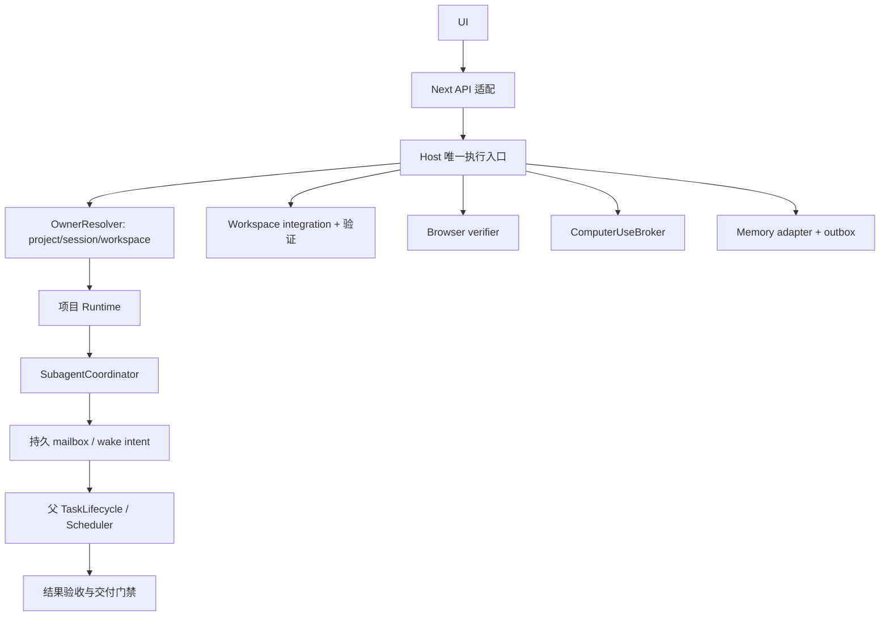

# Lectern 生产链路收口规格

- 日期：2026-09-28
- 状态：待实施；文档交付不代表业务实现或验收完成
- 文档审查：规格及配套计划已独立复审通过（2026-09-28）。
- 范围：zmzai-lectern、zmzai-framework；K1 涉及 zmzai-memory
- 基线：Lectern e2b53bc（0.10.1）；Framework 28d612d4（0.11.0）
- 上位规格：2026-09-21-lectern-host-and-subagents-design.md
- 配套计划：../plans/2026-09-28-production-chain-closure-plan.md

## 1. 目标与完成口径

把已经实现的模块接成可验证的真实产品链路：模型可派生子代理，父任务自动等候和验收；Host 是唯一运行时所有者且正确处理多项目；整合目标只接受验证过的合并结果；浏览器与桌面控制进入统一执行面；项目记忆通过可信接口接通。

这是对既有完整规格的修复与验收计划，不重写 Next、PI、SQLite 或 UI。原规格继续生效；本规格补充生产装配、持久化边界和失败路径。远程执行、Windows CUA、子代理多 worktree 自动合并、插件市场不在范围内。

区分三个交付门槛：R0 核心可靠性修复；R1 验证与控制能力收口；R2 项目记忆与真实任务对照。允许分别发布；R0 完成不能表述为整个计划完成。

## 2. 核查事实

| 编号 | 已确认事实 | 影响 |
| --- | --- | --- |
| F01 | Lectern runtime 的 SubagentCoordinator registry 为 undefined，而 agent_spawn 直接走 registry 解析路径；已以安装包最小复现 undefined.get | 新五工具派生失败 |
| F02 | runChild 忽略 runAttempt 结果并固定返回 completed | 子失败/阻塞可能被误判 |
| F03 | TaskLifecycle 的 subagentPending 固定 null；parked 辅助函数未见生产任务循环调用 | 父等待、唤醒、验收没有完整闭环 |
| F04 | 网关 fetch 异常返回 null，Next 执行原 handler | 响应丢失可能引发第二执行者 |
| F05 | Host 捕获默认工作区 rt；多项目列表已撤回进程内 | 会话读写与控制路由不统一 |
| F06 | worktree 合并产生 merged snapshot 后直接 advanceTarget | 未验证实际合并结果即更新目标 |
| F07 | 默认浏览器计划只访问 / 并断言 body | 仅证明页面存在，不能证明任务成功 |
| F08 | CUA broker 在 Next API 模块内；未见完整模型工具接线 | 不满足 Host 生命周期与统一控制承诺 |
| F09 | K1 目前为 API 盘点，缺完整绑定、可靠写入及纠错契约 | 不可声称长期记忆接通 |

上轮实跑 Framework 28、Lectern 浏览器/CUA 32、worktree 24 项，共 84 项定向测试通过；这不是全量或真实模型/发行包验收。后续报告必须区分模块通过、生产装配通过、平台实测通过。

## 3. 状态所有者与依赖

Next 不创建 Runtime、MCP、终端或桌面控制器。Electron/Main 只持原生能力 adapter 和进程监督；业务 owner 与记录留在 Host。数据库共享不替代执行权隔离。

## 4. R0：生产装配与核心可靠性

### 4.1 唯一子代理创建入口

- 在 Framework 暴露同一 ChildSessionFactory，由真实 registry、父 Session、权限上限、workspace 与 credentialRef 派生创建；新 agent_spawn 与旧 task 都调用该入口。
- 禁止 undefined as never、伪造只有 id 的父 Session、在两条路径各创建一次 childSession。Host 注入服务契约，不依赖 Runner 私有预建约定。
- spawnRequestId 从持久工具调用身份派生，模型未显式提供也必须重试稳定；同键异 payload 拒绝。父身份/根 Task/深度由服务端解析，不能信任模型给任意 childId。
- 创建 childSession、SubagentRecord、初始命令及任务上下文同事务；工具、模型、权限、附件引用均按父授权子集确定。子凭据引用继承父用户，不复制凭据到 prompt。
- runChild 返回显式结构化 outcome：completed/failed/cancelled/blocked/waiting_* 以及 summary、evidence、unknownSideEffect；不能根据 Promise 正常返回推断成功。
- 子限额为 Host 总计 6、根 Task 总计 3（可配置），不是每个项目 Runtime 各享 6。统一 AdmissionController 计数；等待权限释放模型槽，尚有写进程时不释放写权。

### 4.2 持久调度、消息与父验证

- queued 的 prompt/契约持久存储，内存队列仅缓存。Host 重启先对账 executionEpoch/遗留进程，再恢复确认从未开始的 queued；已开始但结果未知者进入恢复审查。
- 子终态、to_parent mailbox 与 wake_intent 同项目事务；wake_intent 为持久表或等价已有持久调度记录，内存 Set 不算持久唤醒。
- 父在模型轮次结束且必要子代理未完成时，通过 CAS 登记 parkedReason=children，并在事务内复查邮箱水位。子先完成/父后 park 的竞争不能丢唤醒。
- Scheduler 认领 wake 意图时检查父 Task 非终态与最新 epoch。父运行中合并至下个安全边界，父已停则同 Task 内部续跑；不创建伪用户消息，不启动两个父执行者。
- mailbox 投递、纳入上下文、结果验收是三件事。投递水位在实际 Attempt 上下文持久登记后才能推进；崩溃可重建，但可见消息、工具副作用不能重复。
- agent_send 必须真正进入子上下文：排队中追加、运行中安全边界接收、waiting_input 由调度器唤醒；blocked/审批不得被普通消息绕过。终态拒绝 send，返工新 spawn 关联替代关系。
- CompletionState 从真实 SubagentStore 计算必要子集合和验收状态，禁止固定 null。提供受控 review/result 服务供父执行器记录 accepted/needs_revision/rejected 与证据；记录由 Host 校验任务树、结果版本与当前文件版本。
- task_deliver 必须拒绝：必要子仍运行、结果未验收、证据过期、未知副作用。拒绝原因进入模型下一轮和 UI，避免没有可用验收入口导致永久卡住。
- 根取消与派生/唤醒使用事务性截止标记；先关闭 admission，再递归停止子及受管进程，最后释放资源。晚到结果只记审计，不复活根任务。

### 4.3 Host 单 owner 与多项目

- 启动时选择 host 或 legacy 模式；运行中不可因请求失败自动换模式。默认 Host 模式，legacy 仅为整次启动的显式回滚选项，启动前确认旧 owner 已退出。
- armed 后 Host 不可达返回结构化 HOST_UNAVAILABLE/结果未知；客户端保留 requestId，重连后查回执。同键重试返回原结果，不能另起本地 Runner。
- Host 请求先解析稳定 commandScope、sessionOwner 与 effectiveWorkspaceRoot，再选择对应 Runtime。列表按显式 projectId；会话操作按持久归属，不能捕获默认 rt 供所有会话使用。
- 用户切换 UI 项目不改变在途任务的库、工具 cwd、终端、MCP、附件或权限回应目标。多项目和各自 worktree 都必须走同一 OwnerResolver。
- 逐项盘点全部 Next API：命令、事件、列表/消息/搜索、附件、终端、MCP、worktree、delivery、浏览器、CUA。读接口也不得从错误库读出“空数据”掩盖归属问题。
- 非迁移接口必须显式标为尚未支持并阻止相关功能发布，不能以旧 handler 维持隐形双执行路径。每批迁移在独立 fixture 验证，生产一次切换 owner。
- 旧 hostInstanceId/run epoch 的取消/审批/回调不能影响新运行；锁、租约接管须核对受管进程状态，数据库 fence 不能撤销已经开始的系统命令。

### 4.4 验证合并结果后再推进目标

- integrate 的状态为 preparing → merged → verifying → ready_to_advance → advancing → integrated，另有 conflict/verification_failed/blocked。
- 在临时整合 worktree 创建固定 merge commit 后，对该提交实际执行 VerificationPlan；证据绑定 mergeCommit、目标锚点、plan version、环境版本与内容 fingerprint。
- 检查不得将目标尚未更新当作失败理由而跳过测试；检查会写缓存时沿用声明排除规则，改动源码使证据 stale。
- 验证失败、无法运行、被取消时不推进目标；无 required 检查标 unverified，只允许既有显式“接受未验证结果”流程，不能显示普通通过。
- 验证过程中目标推进或源快照变化，当前 attempt 不可接受。重新合并/验证产生新 attempt，旧证据仅审计保留。
- ready_to_advance 和验证证据落库后才能更新 ref/checkout；CAS、clean 检查、已 checkout 的 ff-only 保留。恢复可复用仍有效证据，不能跳过验证状态直接调用 advanceTarget。

## 5. R1：浏览器与桌面控制收口

### 5.1 浏览器验证质量

- 显式区分 smoke（页面可访问）与 acceptance（用户任务验收）。默认 goto+body 只作 smoke，不足以将需要业务交互的 Task 标为已验收。
- 开始任务时将可验证要求映射为 VerificationPlan：流程、输入、期望输出/状态、视口与 required 项。模型可提出计划，不能失败后自行删除 required。
- 提供统一 browser 验证/证据工具到 Agent；声明路由与 scope，失败 EvidencePacket 自动进入有界修复；不要求模型猜测内部 HTTP 接口。
- 真实 fixture 至少覆盖表单提交、路由导航、异常提示、响应式要求；功能与视觉 rubric 分开。运行后保存步骤与源码版本证据，不能只有截图。
- BrowserVerifier 生命周期及服务归属在 Host；Electron 驱动只执行平台指令。Next 重启不丢运行记录；无 Electron 的 Web 环境如无已支持 driver，明确 unavailable，不自动降为通过。

### 5.2 Computer use

- 将 Next 模块级 broker 迁入 Host，Next 只代理。模型通过 observe/act/status/stop 等受控工具调用，不绕过 ToolExecutor、根预算、权限与 trace。
- 全桌面单 lease 之外，还需单动作执行队列；同 lease 并发 HTTP/tool 请求必须串行。每个 action 有稳定 ID/回执，不因响应丢失重复点击。
- 执行动作前重新核对真实 app/window/focus 与 observation；5 秒 TTL 不能代替 OS 状态验证。观察变化与动作间仍有竞态，adapter 应使用可识别目标执行并在执行后确认结果。
- 紧急停止独立于模型循环，禁止后续 admission，撤销排队动作并向当前 adapter 发取消。已发到 OS 的动作不能保证撤销，无法确认结果则 unknown；不能报告“已停止”却继续发剩余输入。
- user takeover 必须有真实平台输入接管机制，不能仅有可调用 takeover API。识别不了真实用户输入时标受限能力并禁用无人值守控制，不宣称满足自动接管。
- 根 Task、session、lease 与 targetApp 由 Host 验证对应关系，不接受一个会话借另一个 lease 控制应用。凭据输入由用户处理，截图证据权限不扩大。
- macOS 真机跑功能与取消/接管验收；Windows 继续明确 unavailable。记录能力限制：现有 AX 定位不等于支持全部屏幕坐标、Canvas 或任意原生应用。

## 6. R2：Memory 与真实任务评测

### 6.1 K1 两步接入

K1a 先只读：复用用户认证的 Host credentialRef，经 memory.zmzai.cloud 的服务端权限检查列出 bank；持久绑定本地 projectId 与云端身份，按需 recall，展示来源。当前 API 参数以服务端实存 schema 为准，禁止桌面直连 Hindsight 或读取共享数据库。

- 召回 deadline/预算沿用上位规格（默认 800ms、12 条、2,000 估算 token），超时继续无记忆任务；版本过期、错误项目、未合并分支实验不能作为当前事实。
- 账号退出/撤权清缓存、停同步；旧 outbox 绑定原账号/bank/version，不随重新绑定迁移。

K1b 可靠写入：zmzai-memory 补 capabilities、幂等 retain、operationStatus 关联及 expectedVersion/revise/invalidate 契约，再接 Host outbox。只上传用户允许同步的已验证结构化事实，不上传全量聊天。

- 接收写入与上游完成分离；上游可能已写但响应丢失时 unknown，先对账不盲重试。无法支持的可靠语义必须标 unavailable，不能用随机 ID 包装成幂等。
- 子结果由父归并，未合并结论带分支/任务 scope。memory 不可用不阻塞本地交付；UI 明确待同步与已同步。
- K1a 可独立验收，但不能称为完整项目记忆完成。服务端更新属于单独部署，文档/本地测试不代表线上已发布。

### 6.2 最小真实模型对照

选 6 类固定 fixture：已有项目跨文件修改、失败测试修复、双子代理探索整合、worktree 合并后回归、浏览器表单验收、项目记忆重复任务。每例至少 3 次，记录模型/端点/参数/版本/预算、成功数、人工介入、耗时、token、失败分类。

CUA 另用可控原生 fixture 做平台验收，不把系统权限弹窗混入编码能力对比。能运行 ZCode 时用相同任务/模型预算并注明工具提示差异；无法运行时先给 Lectern 前后对照，不虚构竞品结果。

真实模型出现工具装配异常、假通过、重复副作用，按确定性缺陷处理；成功率统计不能掩盖。数据不足只报告原始计数，不宣称已全面追平 ZCode。

## 7. 验收目录

| ID | 门槛 | 场景与预期 |
| --- | --- | --- |
| PC01 | R0 | 真实 createAgentRuntime + 安装包工具注册触发 agent_spawn/旧 task，正常建立一个子会话，不注入替代协调器 |
| PC02 | R0 | 子失败/取消/blocked/等待输入，父看到真实 outcome；成功 summary/evidence 可用 |
| PC03 | R0 | 两项目同时派生，Host 全局及根限额生效，子无越权或跨根通信 |
| PC04 | R0 | 同 spawn request 重试、异 payload、创建中断，不重复会话和执行 |
| PC05 | R0 | 父 park 与子终态竞争，自动续跑且不创建用户消息 |
| PC06 | R0 | 邮箱提交后/认领前/上下文保存前后强杀，恢复不丢结果不重复副作用 |
| PC07 | R0 | agent_send 在 queued/running/waiting_input 实际进入子上下文；终态拒绝 |
| PC08 | R0 | 子完成未验收、证据过期时 task_deliver 被拒；验收后可完成，不永久卡住 |
| PC09 | R0 | 根取消与派生/唤醒并发，无复活或孤儿写者 |
| PC10 | R0 | Host 已接受命令后丢响应，Next 不本地执行；同 requestId 查得一次回执 |
| PC11 | R0 | Host 启动慢/退出/重启，单 owner；legacy 仅启动模式，不动态切换 |
| PC12 | R0 | 默认项目 + 两个注册项目 + 两个 worktree，列表/命令/事件/附件/终端/MCP 都归属正确 |
| PC13 | R0 | 合并两边各自测试通过但组合失败，目标 ref 不推进 |
| PC14 | R0 | 验证成功后目标推进/源码变化/进程重启，过期证据不放行；有效恢复不重复合并 |
| PC15 | R1 | smoke 通过但表单失败，业务验收不通过；required 不降级 |
| PC16 | R1 | 真实浏览器完成交互→失败证据→一次修复→重验；Next 重启不丢属主 |
| PC17 | R1 | 真实 runtime 工具能调用 Host CUA；会话与 lease 越权被拒 |
| PC18 | R1 | 同 lease 并发动作串行、真实窗口变化拒绝旧观察、用户接管/紧急停止有效 |
| PC19 | R1 | 当前动作结果未知，取消后不盲重发；macOS 实测，Windows 明确 unavailable |
| PC20 | R2 | 真实 memory 域名鉴权/越权/超时/退出登录/重新绑定，召回范围与缓存正确 |
| PC21 | R2 | retain 重试/上游 unknown/纠错版本冲突/权限撤销，可靠回执与作用域不乱 |
| PC22 | R2 | 6 类真实模型任务各 3 次，原始结果和失败归因齐备 |
| PC23 | 各发布 | Framework 源码→build→vendor→安装包版本与能力一致，macOS/Windows 适用烟测及全量回归 |

## 8. 发布、数据迁移与排除事项

- 新 mailbox/wake/验收/命令归属字段增量迁移，保留 ID；同一版本迁移可重复，崩溃可恢复。停止旧 owner 后备份，不能带着活执行者迁移。
- 开发测试使用隔离数据库和 fixture 仓库；不让测试点击用户真实应用、合并用户项目或向实际记忆库写测试数据。
- Framework 变更先独立验证、构建并发布新的唯一版本号或明确不可变预发布版本；Lectern 更新 tarball/lockfile，核对安装后的导出与实际能力。禁止同 0.11.0 文件名静默替换字节造成证据无法关联。
- 发行报告记录三个 commit、tarball hash、包版本、测试平台及未验证项。旧成功报告不能用于新产物；未完成 Windows 真机验证时单独限制其发布声明。
- R0 发布必须 PC01–PC14 与适用 PC23 通过；R1 追加 PC15–PC19；R2 追加 PC20–PC22。真实模型环境缺失可先交付前置修复，但 R2 不算完成。
- 本任务不包含自动部署、推送发布或删除用户数据；实施到可审查产物与验证报告。外部部署沿用用户当时给出的授权。
